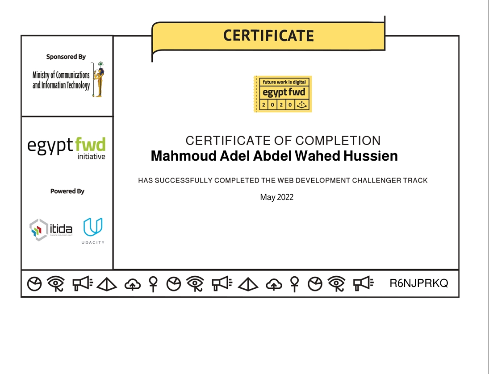
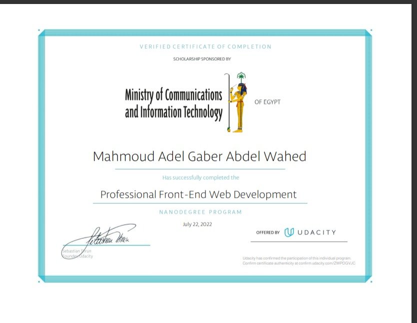

مبرمج يكتب عن الكود ببساطة وشغف.

## 🎥 تابعنا على يوتيوب
-  [قناة Mutawir Web (بالعربية)](https://www.youtube.com/@MutawirWeb)
-  [قناة CodeZelo (بالإنجليزية)](https://www.youtube.com/@CodeZelo)

---

## 🌍 حسابات التواصل الاجتماعي
-  [LinkedIn](https://www.linkedin.com/in/devmahmoudadel/)
-  [TikTok](https://www.tiktok.com/@dev.mahmoud.adel)
-  [Facebook](https://www.facebook.com/DevMahmoudAdel/)
-  [Instagram](https://www.instagram.com/devmahmoudadel/)
-  [X (تويتر)](https://x.com/DevMahmoudAdel)

## شهادات egyFWD

---