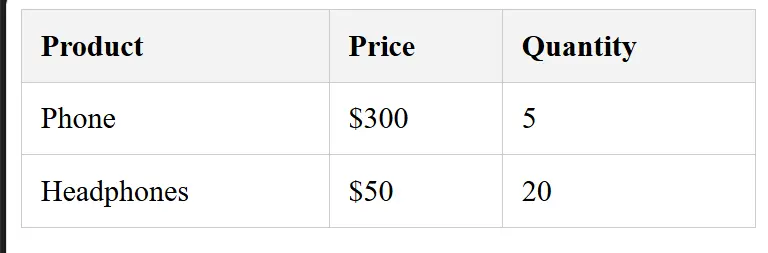

HTML lists and tables are among the most important tags for organizing elements and data within an HTML page. These tags are especially crucial when designing dashboards for enterprise-level systems and company management platforms.

## HTML Lists – Explaining the `ul`, `ol`, and `dl` Tags

HTML lists are essential elements for structuring content on a web page. They are divided into three main types, used according to the nature of the information:

1️. **Unordered List (`ul`)** — Used when the order of items is not important.
2️. **Ordered List (`ol`)** — Suitable when there is a logical sequence to follow.
3️. **Description List (`dl`)** — Used to display terms and their definitions in a structured format.


### 1. Unordered List – `<ul>` Tag

An unordered list is used when we want to display items without any particular sequence or order. To add items to this list, we use the `<li>` tag, which stands for _List Item_.

**Example: displaying the essential programming languages every web developer should learn:**

```html
<ul>
  <li>HTML</li>
  <li>CSS</li>
  <li>JavaScript</li>
</ul>
```

This type of list helps present information clearly and organized, improving the user experience on web pages.

### 2. Ordered List – `<ol>` Tag

An ordered list is used when there is a logical order or sequence of steps to follow. The `<ol>` tag stands for _Ordered List_, and the items inside are written using `<li>`.

**Example: steps to run a simple program:**

```html
<ol>
  <li>Write the code</li>
  <li>Save the file</li>
  <li>Run the program</li>
</ol>
```

The advantage of this type of list is that it clarifies the hierarchical order of content, making the information easier to understand for users and search engines.

### 3. Description List – `<dl>` Tag

A description list is used to present a term along with its explanation or definition. It consists of three main tags:

- `dl` — _Description List_ (the list itself)
- `dt` — _Description Term_ (the term)
- `dd` — _Description Definition_ (the definition or explanation)

**Example: defining some web-related terms:**

```html
<dl>
  <dt>HTML</dt>
  <dd>A markup language used to structure web pages.</dd>

  <dt>CSS</dt>
  <dd>A styling language used to design and layout web pages.</dd>

  <dt>JavaScript</dt>
  <dd>
    A programming language that adds interactivity and dynamic behavior to web
    pages.
  </dd>
</dl>
```

Description lists are very useful in tutorials, glossaries, educational lessons, and technical documentation.

**Conclusion**

HTML lists are not just elements for organizing data—they are essential tools for improving the **structure** of web pages, which positively affects:

- Content readability
- Clarity of information
- User experience (UX)
- Website ranking in search engines (SEO)

## HTML Tables – Importance of Using the `<table>` Tag

Tables are one of the most important HTML elements used to display data in an organized and clear manner. The `<table>` tag is used when we need to arrange large amounts of information, such as product lists, user data, or any content that may exceed hundreds or even thousands of records.
Tables become especially important in complex web systems like **CRM** and **ERP** platforms for enterprise management, as they allow easy display and analysis of data within the user interface.

### How to Create a Table in HTML – Explaining `<table>`, `<thead>`, `<tbody>`, `<tfoot>`

To create a table in HTML, we use the main `<table>` tag.
It is recommended to divide the table into three main sections to organize data and improve readability, especially for large tables:

1️. **Header Section – `<thead>`**
This section contains the row with column headers, helping both users and search engines understand the structure of the data.

2️. **Body Section – `<tbody>`**
This section contains the **actual data**. It is the most important part since it holds the main content.

3️. **Footer Section – `<tfoot>`**
Usually used to display **totals**, **summary results**, or **repeat the headers** for long tables, enhancing the user experience when scrolling.

Inside each section, we use the `<tr>` tag to create a **row**, and then:

- `<th>` inside `<thead>` for **column headers**
- `<td>` inside `<tbody>` or `<tfoot>` for **data cells**

This structure makes the table clearer and easier to read and is ideal for search engines and large web systems.

### Table Attributes in HTML

HTML tables can also support several **attributes** to control the table's appearance, such as:

- `border` to define table borders
- `width` to set the table or column width

**Example:**

```html
<table border="1" width="100%">
  <thead>
    <tr>
      <th>Product</th>
      <th>Price</th>
      <th>Quantity</th>
    </tr>
  </thead>
  <tbody>
    <tr>
      <td>Phone</td>
      <td>$300</td>
      <td>5</td>
    </tr>
    <tr>
      <td>Headphones</td>
      <td>$50</td>
      <td>20</td>
    </tr>
  </tbody>
</table>
```


**Drawbacks of this method:**

- Unprofessional appearance
- Difficult to control
- Not suitable for large projects

Even though these attributes exist, it is always recommended to use **CSS** to control styling and the final appearance.
Using CSS provides a professional look and separates design from structure, which is considered best practice in modern web development.

### Professional Table Styling Using **CSS**

**HTML:**

```html
<table class="product-table">
  <thead>
    <tr>
      <th>Product</th>
      <th>Price</th>
      <th>Quantity</th>
    </tr>
  </thead>
  <tbody>
    <tr>
      <td>Phone</td>
      <td>$300</td>
      <td>5</td>
    </tr>
    <tr>
      <td>Headphones</td>
      <td>$50</td>
      <td>20</td>
    </tr>
  </tbody>
</table>
```

**CSS:**

```css
.product-table {
  width: 100%;
  border-collapse: collapse;
}

.product-table th,
.product-table td {
  padding: 10px;
  border: 1px solid #ccc;
  text-align: left;
}

.product-table thead {
  background-color: #f3f3f3;
  font-weight: bold;
}
```



**Benefits of using CSS:**

- Full control over design
- Reusable classes
- Clean and professional formatting
- Suitable for large projects and ERP/CRM systems

### Advanced Effects (Hover + Zebra Stripes)

```css
.product-table tr:nth-child(even) {
  background-color: #fafafa;
}

.product-table tr:hover {
  background-color: #e8f4ff;
}
```

**Provides a visually appealing and easy-to-read layout, especially for long tables.**

## Conclusion

We have now completed the lesson on **HTML lists and tables**, two essential tools for organizing content and data on web pages.
With this lesson, we have covered a crucial part of **HTML content formatting**, following the previous lesson on [text formatting tags](/en/categories/articles/html-text-tags-simple-guide) and their proper usage.

These concepts are a foundational step for any beginner [learning HTML](/en/series/html-tutorial/), as they form the structure on which any website or web system is built.
In upcoming lessons, we will move on to new concepts that help create more professional and scalable web pages.

**To learn more**

- W3Schools
  - [Lists in HTML](https://www.w3schools.com/html/html_lists.asp)
  - [Table in HTML](https://www.w3schools.com/html/html_tables.asp)

- MDN Web Docs
  - [Lists in HTML](https://developer.mozilla.org/en-US/docs/Learn_web_development/Core/Structuring_content/Lists)

  - [Tables in HTML](https://developer.mozilla.org/en-US/docs/Web/HTML/Reference/Elements/table)
