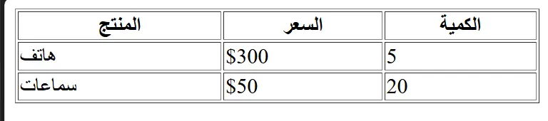

القوائم والجدول في HTML هي من الوسوم المهمة في ترتيب العناصر والبيانات داخل صفحة الـ HTML. وتعتبر تلك الوسوم مهمة جداً خصوصاً أثناء تصميم لوحات التحكم في أنظمة إدارة الشركات والمؤسسات الكبيرة.

## القوائم في HTML – شرح وسوم `ul` و `ol` و `dl`

تُعدّ القوائم في HTML من العناصر الأساسية لتنظيم المحتوى داخل صفحة الويب، وتنقسم إلى ثلاثة أنواع رئيسية تُستخدم وفقًا لطبيعة المعلومات:

1️. **القائمة غير المرقمة (Unordered List)** — نستخدمها عندما لا يكون ترتيب العناصر مهمًا.  
2️. **القائمة المرقمة (Ordered List)** — مناسبة عند وجود ترتيب منطقي يجب اتباعه.  
3️. **قائمة التعريف (Description List)** — تُستخدم لعرض المصطلحات وتعريفاتها بشكل منسّق.


### 1. القائمة غير المترتبة — وسم `ul`

تُستخدم القائمة غير المرقمة عندما نرغب في عرض عناصر بدون أي تسلسل أو ترتيب معين. ولإضافة عناصر داخل هذه القائمة نستخدم وسم `li` المختص بإضافة عنصر داخل القائمة. وهو إختصار لـ List Item.

على سبيل المثال، إذا أردنا عرض أهم اللغات الأساسية التي يجب على أي مبرمج ويب تعلّمها، يمكننا استخدام وسم `ul` (اختصارًا لـ _unordered list_) بالشكل التالي:

```html
<ul>
  <li>HTML</li>
  <li>CSS</li>
  <li>JavaScript</li>
</ul>
```

هذا النوع من القوائم يساعد في عرض المعلومات بشكل واضح ومنظّم، وهو عنصر مهم في تحسين تجربة المستخدم داخل صفحات الويب.

### 2. القائمة المرقمة – وسم `ol`

نستخدم القائمة المرقمة عندما يكون هناك ترتيب منطقي أو خطوات يجب اتباعها بالتسلسل.  
يمثل وسم `ol` اختصارًا لـ _Ordered List_، بينما تُكتب العناصر داخل الوسم `li`.

**مثال: خطوات تنفيذ برنامج بسيط:**

```html
<ol>
  <li>اكتب الكود</li>
  <li>احفظ الملف</li>
  <li>شغّل البرنامج</li>
</ol>
```

ميزة هذا النوع من القوائم أنه يوضح التسلسل الهرمي للمحتوى، مما يساعد على تحسين وضوح المعلومات للمستخدمين ومحركات البحث.

### 3. قائمة التعريف – وسم `dl`

تُستخدم قائمة التعريف عندما نرغب في تقديم مصطلح مع شرحه أو تعريفه.  
وتتكوّن من ثلاث وسوم رئيسية:

- `dl` — _Description List_ (القائمة نفسها)
- `dt` — _Description Term_ (المصطلح)
- `dd` — _Description Definition_ (شرح المصطلح)

**مثال: تعريف بعض مصطلحات الويب:**

```html
<dl>
  <dt>HTML</dt>
  <dd>لغة ترميز تُستخدم لبناء هيكل صفحات الويب.</dd>

  <dt>CSS</dt>
  <dd>لغة تنسيق تُستخدم لتصميم وتنظيم مظهر الصفحة.</dd>

  <dt>JavaScript</dt>
  <dd>لغة برمجة تُضيف التفاعل والحركة لصفحات الويب.</dd>
</dl>
```

قوائم التعريف مفيدة جدًا في الشروحات، القواميس، الدروس التعليمية، والوثائق التقنية.

**في النهاية**

القوائم في HTML ليست مجرد عناصر لترتيب البيانات، بل هي أدوات أساسية لتحسين **الهيكلة (Structure)** داخل صفحات الويب، مما ينعكس إيجابًا على:

- سهولة قراءة المحتوى
- وضوح المعلومات
- تحسين تجربة المستخدم (UX)
- تحسين ترتيب الموقع في نتائج البحث (SEO)

## الجداول في HTML – أهمية استخدام وسم `table`

تُعدّ الجداول واحدة من أهم عناصر HTML المستخدمة في عرض البيانات بطريقة منظمة وواضحة. ويُستخدم وسم `table` عندما نحتاج إلى ترتيب معلومات كبيرة الحجم مثل قوائم المنتجات، بيانات المستخدمين، أو أي محتوى يتجاوز المئات أو حتى الآلاف من السجلات.  
تظهر أهمية الجداول بشكل أكبر في أنظمة الويب المعقدة مثل أنظمة **CRM** و **ERP** الخاصة بإدارة الشركات والمؤسسات، حيث تمكّن من عرض البيانات وتحليلها بسهولة داخل واجهة الاستخدام.

### كيفية إنشاء جدول في HTML – شرح وسوم `table`, `thead`, `tbody`, `tfoot`

لإنشاء جدول في HTML، نستخدم الوسم الأساسي `<table>`.  
ويُفضَّل تقسيم الجدول إلى ثلاثة أجزاء رئيسية تساعد في تنظيم البيانات وتحسين القراءة، خاصة عند التعامل مع جداول كبيرة:

1️. **الجزء العلوي للعناوين – `<thead>`**  
يُستخدم هذا الجزء لكتابة الصف الذي يحتوي على عناوين الأعمدة، مما يساعد المستخدم ومحركات البحث على فهم بنية البيانات.

2️. **الجزء الأوسط — `<tbody>`**  
هنا نضع **البيانات الفعلية** داخل الجدول. ويعتبر هذا القسم أهم جزء لأنه يحتوي على المحتوى الرئيسي.

3️. **الجزء السفلي — `<tfoot>`**  
يُستخدم عادة لعرض **الإجماليات**، أو **نتائج التحليل**, أو **تكرار العناوين** في الجداول الطويلة. ويساعد ذلك على تحسين تجربة المستخدم عند التمرير لأسفل.

داخل كل جزء من هذه الأجزاء نستخدم الوسم `<tr>` لإنشاء **صف** داخل الجدول،  
ثم نستخدم:

- وسم `<th>` داخل `<thead>` لعرض **عناوين الأعمدة**
- وسم `<td>` داخل `<tbody>` أو `<tfoot>` لعرض **خلايا البيانات**

هذا التنظيم يجعل الجدول أكثر وضوحًا وسهولة في القراءة، كما يُعد بنية مثالية لمحركات البحث ولأنظمة الويب الكبيرة.

### خصائص الجدول في HTML

بالإضافة إلى ذلك، يمكن للجداول في HTML أن تدعم مجموعة من **الخصائص (Attributes)** التي تساعد في التحكم في شكل الجدول، مثل:

- `border` لتحديد ظهور حدود الجدول.
- `width` لتحديد عرض الجدول أو الأعمدة.

**مثال علي ذلك:**

```html
<table border="1" width="100%">
  <thead>
    <tr>
      <th>المنتج</th>
      <th>السعر</th>
      <th>الكمية</th>
    </tr>
  </thead>
  <tbody>
    <tr>
      <td>هاتف</td>
      <td>$300</td>
      <td>5</td>
    </tr>
    <tr>
      <td>سماعات</td>
      <td>$50</td>
      <td>20</td>
    </tr>
  </tbody>
</table>
```




**عيوب الطريقة:**

- شكل غير احترافي
- صعوبة التحكم
- غير مناسب للمشاريع الكبيرة

لكن رغم توفر هذه الخصائص داخل وسم `<table>`, يُفضَّل دائمًا استخدام **CSS** للتحكم في التنسيق والشكل النهائي.  
فالاعتماد على CSS يمنحك مظهرًا احترافيًا، ويساعد على فصل التصميم عن الهيكل، وهو ما يعتبر أفضل ممارسة في تطوير واجهات الويب الحديثة.

### تنسيق الجدول باحتراف باستخدام **CSS**

```html
<table class="product-table">
  <thead>
    <tr>
      <th>المنتج</th>
      <th>السعر</th>
      <th>الكمية</th>
    </tr>
  </thead>
  <tbody>
    <tr>
      <td>هاتف</td>
      <td>$300</td>
      <td>5</td>
    </tr>
    <tr>
      <td>سماعات</td>
      <td>$50</td>
      <td>20</td>
    </tr>
  </tbody>
</table>
```

```css
.product-table {
  width: 100%;
  border-collapse: collapse;
}

.product-table th,
.product-table td {
  padding: 10px;
  border: 1px solid #ccc;
  text-align: left;
}

.product-table thead {
  background-color: #f3f3f3;
  font-weight: bold;
}
```


**مميزات استخدام CSS:**

- التحكم الكامل في التصميم
- إمكانية إعادة استخدام الكلاس
- تنسيق نظيف ومحترف
- مناسب للمشاريع الكبيرة وأنظمة الـ ERP و CRM

### إضافة تأثيرات متقدمة (Hover + Zebra Style)

```css
.product-table tr:nth-child(even) {
  background-color: #fafafa;
}

.product-table tr:hover {
  background-color: #e8f4ff;
}
```

**يعطي شكل جميل وسهل القراءة—خصوصًا للجداول الطويلة.**

## في النهاية

نصل بهذا إلى نهاية درس **القوائم والجداول في HTML**، وهما من أهم الأدوات المستخدمة لتنظيم المحتوى وترتيب البيانات داخل صفحات الويب.  
ومع هذا الدرس نكون قد أكملنا جزءًا مهمًا من أساسيات **تنسيق المحتوى في HTML**، بعد أن انتهينا في الدرس السابق من شرح جميع [وسوم تنسيق النصوص](/categories/articles/html-text-tags-simple-guide) والطريقة الصحيحة لاستخدامها.

هذه المفاهيم تُعدّ خطوة أساسية لأي مبتدئ في [تعلم HTML](/series/html-tutorial/)، لأنها تشكل الهيكل الذي يُبنى عليه أي موقع أو نظام ويب متكامل.  
في الدروس القادمة سننتقل إلى مفاهيم جديدة تساعدك على تطوير صفحات أكثر احترافية وقابلة للتطوير.

**للمزيد من المعلومات**

- W3Schools
  - [القوائم في HTML](https://www.w3schools.com/html/html_lists.asp)
  - [الجداول في HTML](https://www.w3schools.com/html/html_tables.asp)

- MDN Web Docs
  - [القوائم في HTML](https://developer.mozilla.org/en-US/docs/Learn_web_development/Core/Structuring_content/Lists)

  - [الجداول في HTML](https://developer.mozilla.org/en-US/docs/Web/HTML/Reference/Elements/table)
