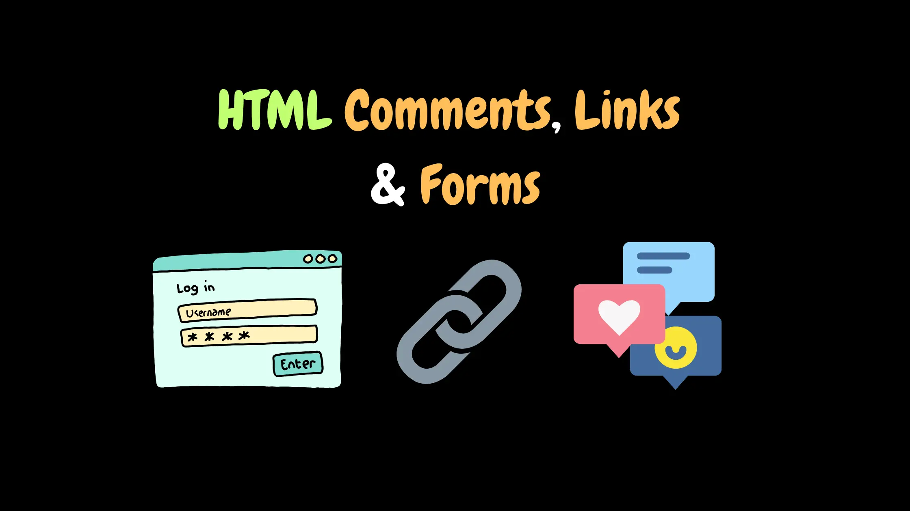
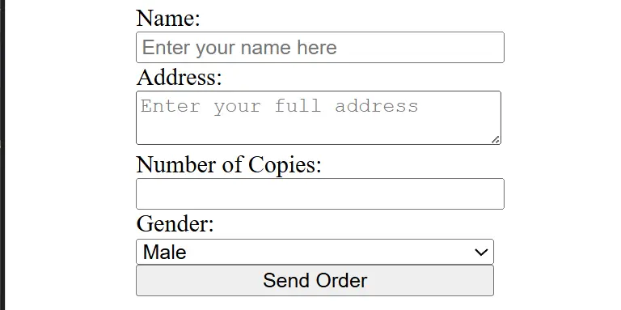

In previous articles, we explained [Semantic Elements](/en/categories/articles/semantic-elements-and-content-elements/), [Tables](/en/categories/articles/html-lists-and-tables/), and [HTML Text Formatting Tags](/en/categories/articles/html-text-tags-simple-guide/) in detail, each on its own. In this article, we will cover some remaining tags together in one place to complete the [HTML Basics](/en/series/html-tutorial/) and prepare ourselves to move on to the next stage of learning web development.

This article is considered **the final part of the HTML from Scratch course**. After completing it, we will start the [CSS from Scratch course](/en/series/css-tutorial/), where we will learn how to style pages and professionally enhance website designs.



## Comments in HTML

Comments in HTML are a way to leave notes inside your code,
whether it's **a single line** or **multiple lines**.

They are written like this:

```html
<!-- This is a comment in HTML -->
<!-- 
	This is a multi-line comment in HTML 
	Second line
	Third line
-->
```

So, what’s the purpose of comments in the first place?

1️. **They help you remember** why you wrote a certain piece of code, especially if you come back to it later.

2️. **They make collaboration easier** if you are working in a team,
so anyone reading the code can quickly understand what each part does.

3️. **They are useful for testing**
You can temporarily disable a piece of code without deleting it
by wrapping it in comments so it doesn’t execute.

Comments do not appear in the browser or to visitors;
they are purely internal information for you or your team.

That wraps up the section on comments.

## Links in HTML – Explaining the `<a>` Tag

After covering most HTML tags, it’s now important to understand how web pages are connected to each other, so we can see why HTML is like a web of interconnected pages.

To link web pages together, we use a very important tag called `<a>`
which stands for **anchor** ⚓.

### What is a Hyperlink?

You know that the idea of links is what made the internet appear the way we know it today?
Before links, pages were just separate files.
But when links appeared, pages became **interconnected** like a spider web—hence the term **Web**.

The word **Hyperlink** simply means “a super link,”
because it takes you from one place to another on the internet,
just like Aladdin’s magic carpet transporting him instantly.
It can link to a page on the same site or a completely different website.

### How the `<a>` Tag Works

The anchor tag is written like this:

```html
<a href="page.html">Go to the page</a>
```

> The **href** attribute (short for *Hypertext Reference*) is the most important part of the tag,
> because it specifies **where the link will take the user** when clicked.

The text between `<a>` and `</a>` is what appears to the user.
When they click it, they are taken to the URL specified in `href`.

### Types of Links

Links are generally divided into two main types:

#### 1️. Relative Links

This type is used when linking **pages within the same project**.

For example, if you have two files:

* `index.html`
* `about.html`

and they are in the same folder,
you can write the links like this:

```html
<a href="index.html">Home</a>
<a href="about.html">About</a>
```

Now, when the user clicks the link,
they will go directly to the **about.html** page in the same folder,
or back to the homepage by clicking the Home link, which goes to `index.html`.

If the page is in a **subfolder**,
we write the path like this:

```html
<a href="pages/contact.html">Contact Us</a>
```

#### 2️. Absolute Links

If the page is on an **external website**,
we use the **full URL**:

```html
<a href="https://www.google.com">Go to Google</a>
```

This takes the user to a completely different website.

### Opening Links in the Same Tab or a New Tab

By default, a link opens in the **same tab**.
But if you want it to open in a **new tab**,
you can add the `target` attribute like this:

```html
<a href="https://google.com" target="_blank">Open Google in a new tab</a>
```

* `_blank` means “open in a new tab or window.”
* `_self` means “open in the same page or tab,” which is the default value.


### Useful Additional Attributes

There are some extra attributes you can add to the `<a>` tag to improve functionality or SEO:

* `title` ➜ Shows a tooltip when the mouse hovers over the link:

```html
<a href="about.html" title="Learn more about us">About</a>
```

* `download` ➜ Makes the link download a file instead of opening it:

```html
<a href="book.pdf" download>Download the book</a>
```

## Forms in HTML – Explaining the `<form>` Tag

Now, imagine we decided to sell a product.
Of course, we would need a **form** to collect visitors’ orders,
so we can know, for example, the person’s name, address, and how many copies they want to buy.

This is where the most important tag for interacting with users comes in: the `<form>` tag.
It acts as a **container** for all **input fields**, such as name, email, password, and more.

The `<form>` tag has **three very important attributes** you should know:



### 1️. The `action` Attribute

This attribute simply defines **where the form data will be sent** after the user clicks the Submit button.

* If the data is sent to **a file within the project**, we write a relative path like this:

```html
<form action="submit.php"></form>
```

* If the data is sent to **an external website or API**, we use the full URL like this:

```html
<form action="https://example.com/api"></form>
```

### 2️. The `method` Attribute

This attribute specifies **how the data will be sent**. There are two main methods:

* **GET:**
  The data is sent in the **URL itself**, meaning it appears in the address bar after the `?` symbol,
  like this:
  `example.com/form?name=Mahmoud&copies=2`
  This is useful for simple data without sensitive information.

* **POST:**
  Here, the data is sent **inside the request body**, hidden from the user.
  This is used for **sensitive forms**, such as login or payment forms.

### 3️. The `enctype` Attribute

This attribute is used when the form includes **file uploads**, for example, if the user uploads an image or attachment.
In this case, we write it like this:

```html
<form method="post" enctype="multipart/form-data"></form>
```

It tells the browser how to prepare the data that includes files before sending it to the server.
With this, we have prepared **the basic structure for any HTML form**.

### **Types of Fields in Forms (Form Inputs)**

Now that we have created the form itself, it’s time to add **the fields where users will enter data**.

There are many types of fields in HTML, and each type serves a different purpose. Let’s start with a simple practical example: a product order form for the product we want to sell.

#### 1️. Text Input

The first thing we need is the **buyer’s name**.
Here, we use the `<input>` tag with type "text" like this:

```html
<form method="post" action="submit.php">
	<input type="text" name="username" placeholder="Enter your name here" />
</form>
```

The `name` attribute is very important
because it tells the server **the name of the data being sent** when the user clicks “Submit.”

#### 2️. Textarea

Next, we need the buyer to enter their **full address**.
Since this could be long, we use a `<textarea>` instead of `<input>`:

```html
<form method="post" action="submit.php">
	<input type="text" name="username" placeholder="Enter your name here" />
	<textarea name="address" placeholder="Enter your full address"></textarea>
</form>
```

#### 3️. Number Input

Now, the buyer needs to specify **how many copies they want to purchase**.
We use the number type like this:

```html
<form method="post" action="submit.php">
	<input type="text" name="username" placeholder="Enter your name here" />
	<textarea name="address" placeholder="Enter your full address"></textarea>
	<input type="number" name="copies" min="1" max="10" />
</form>
```

* The `min` attribute sets the minimum quantity that can be purchased (here, 1).
* The `max` attribute sets the maximum quantity that can be purchased (here, 10).

#### 4️. Submit Button

After the buyer enters their information, there must be a **Submit button** that sends the data to the URL specified in the `action` attribute.
We write it like this:

```html
<form method="post" action="submit.php">
	<input type="text" name="username" placeholder="Enter your name here" />
	<textarea name="address" placeholder="Enter your full address"></textarea>
	<input type="number" name="copies" min="1" max="10" />
	<input type="submit" value="Submit Order" />
</form>
```

Now we have built a simple form that includes all the **basic requirements for any HTML form**.

But let’s continue, because there are other important types of fields to cover.

#### 5. Select Input

One of the most important fields is the **Select dropdown**, which we use when we want the user to choose from multiple options.

For example, we can add a gender selection for the buyer—Male or Female:

```html
<form method="post" action="submit.php">
	<input type="text" name="username" placeholder="Enter your name here" />
	<textarea name="address" placeholder="Enter your full address"></textarea>
	<input type="number" name="copies" min="1" max="10" />
	
	<select name="gender">   
		<option value="male">Male</option>   
		<option value="female">Female</option> 
	</select>
	
	<input type="submit" value="Submit Order" />
</form>
```

Of course, we can also add a **label** for each field. To see the difference, let’s add labels for all fields:

```html
<form method="post" action="submit.php">
	<label>Name:
		<input type="text" name="username" placeholder="Enter your name here" />
	</label>
	
	<label>Address:
		<textarea name="address" placeholder="Enter your full address"></textarea>
	</label>
	
	<label>Number of Copies:
		<input type="number" name="copies" min="1" max="10" />
	</label>
	
	<label>Gender:
		<select name="gender">   
			<option value="male">Male</option>   
			<option value="female">Female</option> 
		</select>
	</label>
	
	<input type="submit" value="Submit Order" />
</form>
```

You can also allow selecting multiple options by adding the `multiple` attribute to the `<select>` field:

```html
<select multiple>...</select>
```

#### 6. Checkbox Input

The next type is **Checkbox**, which we use when we want to provide an on/off choice, for example:

```html
<label>   
	<input type="checkbox" name="subscribe" />   
	Subscribe to the newsletter
</label>
```

Remember:
Every field should always have a `name` attribute so the server can identify the data coming from each input.

With this, we have completed the **essential part of HTML forms**,
and we now know how to collect visitor data in a practical and organized way.

**For more information**

* W3Schools

  * [HTML Comments](https://www.w3schools.com/html/html_comments.asp)
  * [HTML Links](https://www.w3schools.com/tags/tag_a.asp)
  * [HTML Forms](https://www.w3schools.com/html/html_forms.asp)

* MDN Web Docs

  * [HTML Comments](https://developer.mozilla.org/en-US/docs/Web/HTML/Guides/Comments)
  * [HTML Links](https://developer.mozilla.org/en-US/docs/Web/HTML/Reference/Elements/a)
  * [HTML Forms](https://developer.mozilla.org/en-US/docs/Web/HTML/Reference/Elements/form)

