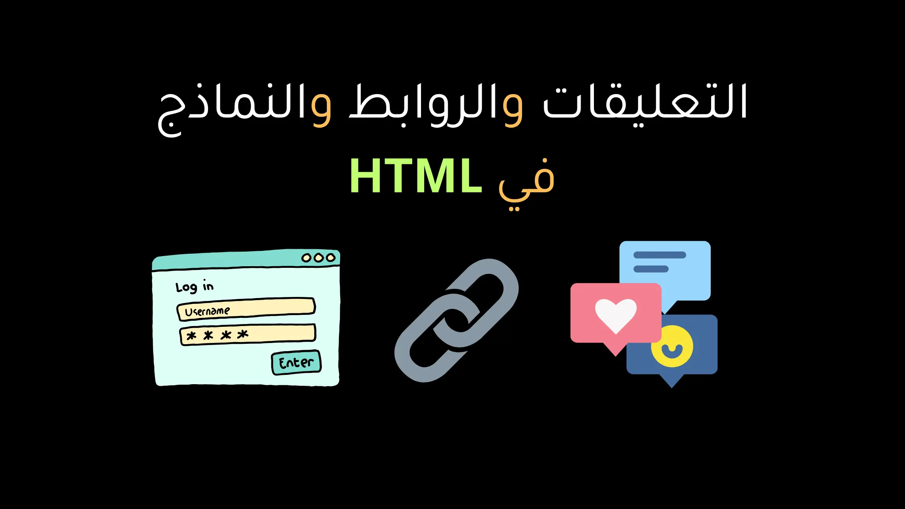
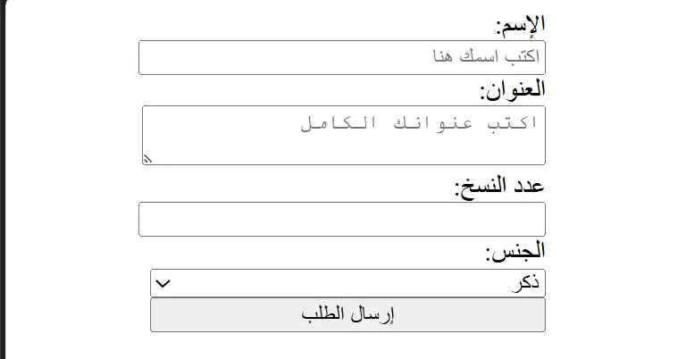

في المقالات السابقة قمنا بشرح [الوسوم الدلالية](/categories/articles/semantic-elements-and-content-elements/) و[الجداول (Tables)](/categories/articles/html-lists-and-tables/) و[الوسوم الخاصة بتنسيق النصوص](/categories/articles/html-text-tags-simple-guide/) في HTML بشكل مفصّل كلٌ على حدة. أما في هذا المقال، سنتناول بعض الوسوم المتبقية معًا في مكان واحد حتى نُكمل [أساسيات لغة HTML](/series/html-tutorial/) بشكل كامل ونُصبح مستعدين للانتقال إلى المرحلة التالية من تعلم تطوير واجهات الويب.

هذه المقالة تُعتبر **الجزء الأخير من دورة HTML من الصفر**، وبعد الانتهاء منها سنبدأ مباشرة [دورة CSS من الصفر](/series/css-tutorial/)، والتي سنتعلم فيها كيفية تنسيق الصفحات وتحسين تصميم المواقع باحترافية.



## التعليقات (Comments) في HTML

التعليقات في HTML بتكون وسيلة نسيب بيها ملاحظات جوه الكود،  
سواء **سطر واحد** أو **أكتر من سطر**.

وبتتكتب بالشكل ده


```html
<!-- ده تعليق في HTML -->
<!-- 
	ده تعليق متعدد الأسطر في HTML 
	السطر التاني
	السطر التالت
-->
```
 
طيب، إيه فايدة التعليقات أصلًا؟

1️. **بتساعدك تفتكر** ليه كتبت جزء معين من الكود خصوصًا لو رجعتله بعد فترة.

2️. **بتسهّل التعاون** لو إنت بتشتغل في فريق،  
	علشان أي حد يقرأ الكود يفهم بسرعة كل جزء بيعمل إيه.
 
3️. **بتفيد وقت التجربة**
	ممكن توقف كود مؤقتًا من غير ما تمسحه،  
	بس تحطّه بين تعليقات علشان ما يتنفذش.

التعليقات مش بتظهر لا في المتصفح ولا للزائر،  
يعني كلها معلومات داخلية خاصة بيك أو بالفريق اللي شغال معاك.

كده نكون خلصنا الجزء الخاص بالتعليقات،  

## الروابط في HTML - شرح وسم الـ `<a>`

بعد ما انتهينا من أغلب وسوم الـ HTML،  هيبقي مطلوب منك تفهم إزاي صفحات الويب بتتربط بعضها ببعض عشان نفهم ليه HTML زي شبكة العنكبوت.

عشان نربط صفحات الويب مع بعض هنقوم باستخدام وسم مهم جدًا اسمه `<a>`  
وهو اختصارًا لكلمة **anchor** يعني “مرساة” ⚓

### يعني إيه الـ Hyperlink؟

عارف إن فكرة اللينك هي اللي خلت الإنترنت يظهر بالشكل اللي إحنا عارفينه النهارده؟
قبلها، كانت الصفحات مجرد ملفات منفصلة.  
لكن لما ظهرت اللينكات، بقت الصفحات **مترابطة** زي شبكة عنكبوت ومن هنا جت كلمة **Web**.

وكلمة **Hyperlink** معناها ببساطة “رابط فائق”،  
لأنه بينقلك من مكان لمكان تاني على الإنترنت زي بالظبط سجادة علاء الدين اللي كانت بتنقله من مكان لمكان في لحظة.
سواء كانت الصفحة على نفس الموقع أو موقع مختلف تمامًا.

### شرح وسم الرابط `<a>`
وسم الرابط بيتكتب كده:

```html
<a href="page.html">اذهب إلى الصفحة</a>
```

> الخاصية **href** (اختصار لـ _Hypertext Reference_) هي أهم حاجة في الوسم،  
    لأنها بتحدّد **المكان اللي هيروح له الرابط** لما المستخدم يضغط عليه.
    

النص اللي بين `<a>` و `</a>` هو اللي بيظهر قدام المستخدم.  
ولما يضغط عليه، بيروح للعنوان اللي مكتوب في `href`.


### أنواع الروابط

الروابط بتنقسم لنوعين أساسين:

#### 1️. الروابط النسبية (Relative Links)

ده النوع اللي بنستخدمه لما نربط بين **صفحات داخل نفس المشروع**.

مثلاً لو عندك ملفين:

- index.html
- about.html
    

وسايبهم في نفس المجلد،  
تقدر تكتب الرابط بالشكل ده:

```html
<a href="index.html">الرئيسية</a>
<a href="about.html">عن الموقع</a>
```

كده لما المستخدم يضغط على الرابط،  
هينتقل مباشرة لصفحة **about.html** اللي في نفس المجلد.
أو ننتقل للصفحة الرئيسية عن طريق الضغط علي رابط الرئيسية وهينتقل لملف `index.html`.

ولو كانت الصفحة موجودة في **مجلد فرعي**،  
نكتب المسار بالشكل ده:

```html
<a href="pages/contact.html">تواصل معنا</a>
```

#### 2️. الروابط المطلقة (Absolute Links)

أما لو الصفحة موجودة على **موقع خارجي**،  
بنستخدم **الرابط الكامل** (الـ URL):

```html
<a href="https://www.google.com">اذهب إلى جوجل</a>
```

وده بيخلي المستخدم يروح لموقع تاني تمامًا.

### فتح الرابط في نفس الصفحة أو صفحة جديدة

بشكل افتراضي، اللينك بيفتح في **نفس التبويب**. لكن لو حبيت تخليه يفتح في **صفحة جديدة**،  
بنضيف خاصية اسمها `target` بالشكل ده:

```html
<a href="https://google.com" target="_blank">افتح موقع جوجل في تبويب جديد</a>
```

الكلمة `_blank` معناها “افتح في صفحة أو تبويب جديد”.
الكلمة `_self` معناها “افتح في نفس الصفحة أو نفس التبويب”. وهذه هي القيمة الإفتراضية.

### خصائص إضافية مفيدة:
هناك بعض الخصائص التي يمكن إضافتها الي وسم `<a>` لتحسينه في محركات البحث أو لتنفيذ مهمة معينة.

- `title` ➜ بتظهر تلميح (Tooltip) لما الماوس يقف فوق الرابط:
```html
<a href="about.html" title="اعرف المزيد عنا">عن الموقع</a>
```

- `download` ➜ بتخلي الرابط ينزّل ملف بدل ما يفتحه:
```html
<a href="book.pdf" download>تحميل الكتاب</a>
```

## النماذج في HTML - شرح وسم الـ `<form>`.

دلوقتي تخيّل إننا قررنا نبيع منتج معين فأكيد هنحتاج نعمل **نموذج** يستقبل طلبات الزوار،  
عشان نعرف مثلًا اسم الشخص، عنوانه، وعدد النسخ اللي حابب يشتريها.

وهنا بييجي دور أهم وسم في التعامل مع المستخدمين: وهو وسم الـ `<form>`.
وده يعتبر الوعاء اللي بنحط جواه كل **حقول الإدخال** زي الاسم والبريد الإلكتروني وكلمة المرور وغيرها.

وسم الفورم ليها **3 خصائص مهمة جدًا** لازم تعرفهم:



### 1️. الخاصية `action`

 الخاصية دي ببساطة بتحدد **المكان اللي هتروح له البيانات** بعد ما المستخدم يضغط على زر الإرسال (Submit).
  - لو البيانات هتروح **لملف داخل المشروع**، نكتب المسار النسبي بالشكل ده: 
    ```html
    <form action="submit.php"></form>
    ``` 
 - ولو البيانات هتتبعت **لموقع خارجي أو API**، نستخدم المسار المطلق بالشكل ده: 
	```html
	<form action="https://example.com/api"></form>
	``` 

### 2️. الخاصية `method`
الخاصية دي بتحدد **طريقة إرسال البيانات**، وهنلاقي طريقتين أساسيين:

- الطريقة الأولي **GET:**  
البيانات بتتبعت في **رابط الصفحة نفسه**، يعني هتظهر في شريط العنوان بعد علامة `?`،  
وهتظهر بالشكل ده:  
`example.com/form?name=Mahmoud&copies=2`  
وده بيكون مفيد لو البيانات بسيطة ومفيش معلومات حساسة.

- الطريقة الثانية **POST:**  
هنا البيانات بتتبعت **داخل جسم الطلب (Body)**، يعني مخفية عن المستخدم،  
وده اللي بنستخدمه في **الفورمات الحساسة** زي تسجيل الدخول أو الدفع.

### 3️. الخاصية `enctype`
الخاصية دي بتستخدم لما يكون عندنا **رفع ملفات** داخل النموذج، زي مثلًا لو المستخدم بيرفع صورة أو مرفق. 
في الحالة دي لازم نكتب القيمة بالشكل ده:  
```html
<form method="post" enctype="multipart/form-data"></form>
```

لأنها بتخلي المتصفح يعرف إزاي يجهز البيانات اللي فيها ملفات قبل ما يرسلها للسيرفر. وبكده نكون جهزنا **الهيكل الأساسي لأي نموذج** في HTML.

### **أنواع الحقول داخل النماذج (Form Inputs)**

دلوقتي بعد ما أنشأنا النموذج نفسه، جه الوقت نضيف جواه **الحقول اللي المستخدم هيكتب فيها البيانات**.

الحقول دي ليها أنواع كتير جدًا في HTML،  وكل نوع بيخدم غرض مختلف. خلينا نبدأ بمثال عملي بسيط.
نموذج طلب شراء المنتج اللي عايزين نبيعه كمثال بسيط.

#### أولًا: حقل النص (Text Input)

أول حاجة محتاجينها هي إننا ناخد **اسم المشتري**.  
هنا هنستخدم وسم `<input>` ونخلي نوعه نصي بالشكل ده:

```html
<form method="post" action="submit.php">
	<input type="text" name="username" placeholder="اكتب اسمك هنا" />
</form>
```

الخاصية `name` هنا مهمة جدًا
لأنها هي اللي بتخلي السيرفر يعرف **اسم البيانات اللي بتتبعت** لما المستخدم يضغط على “إرسال”.

#### ثانيًا: حقل النصوص الطويلة (Textarea)

بعد كده محتاجين المشتري يكتب **عنوانه بالتفصيل**.  وده ممكن يكون طويل شوية، فبدل `<input>` هنستخدم:

```html
<form method="post" action="submit.php">
	<input type="text" name="username" placeholder="اكتب اسمك هنا" />
	<textarea name="address" placeholder="اكتب عنوانك الكامل"></textarea>
</form>
```

#### ثالثًا: الحقل الرقمي (Number)

دلوقتي المشتري محتاج يحدد **عدد القطع اللي عايز يشتريها**. هنستخدم النوع الرقمي بالشكل ده:
```html
<form method="post" action="submit.php">
	<input type="text" name="username" placeholder="اكتب اسمك هنا" />
	<textarea name="address" placeholder="اكتب عنوانك الكامل"></textarea>
	<input type="number" name="copies" min="1" max="10" />
</form>
```

- خاصية `min` تحدد أقل عدد يمكن شراءه من المنتج. وهنا حددناه بقطعة واحدة.
- خاصية `max` تحدد أكبر عدد يمكن شراءه من المنتج. وهنا حددناه بـ 10 قطع.
 
####  ثالثاً: زر الإرسال (Submit)

بعد ما المشتري يكتب بياناته، لازم يكون فيه **زر إرسال** ينقل البيانات للمسار اللي موجود في خاصية `action`.
بنكتبه بالشكل ده:
```html
<form method="post" action="submit.php">
	<input type="text" name="username" placeholder="اكتب اسمك هنا" />
	<textarea name="address" placeholder="اكتب عنوانك الكامل"></textarea>
	<input type="number" name="copies" min="1" max="10" />
	<input type="submit" value="إرسال الطلب" />
</form>
```

  كده هنكون إنتهينا من بناء فورم بسيط فيه كل المتطلبات الأساسية لأي **فورم أو نموذج HTML**.

لكن خلينا نكمّل. لأن فيه أنواع حقول تانية مهمة جدًا. 

#### رابعاً: حقل الاختيار (Select)

من أهم الحقول **قائمة الاختيار (Select)** واللي بنستخدمها لما نحتاج المستخدم يختار من بين مجموعة خيارات.

مثلًا نضيف للمشتري اختيار الجنس. سواء ذكر أو أنثى:
:
```html
<form method="post" action="submit.php">
	<input type="text" name="username" placeholder="اكتب اسمك هنا" />
	<textarea name="address" placeholder="اكتب عنوانك الكامل"></textarea>
	<input type="number" name="copies" min="1" max="10" />
	
	<select name="gender">   
		<option value="male">ذكر</option>   
		<option value="female">أنثى</option> 
	</select>
	
	<input type="submit" value="إرسال الطلب" />
</form>
```

وطبعاً ممكن نضيف لكل حقل عن طريق إستخدام وسم `<label>`. وعشان نشوف الفرق تعالي نضيف العنوان لكل حقل.

```html
<form method="post" action="submit.php">
	<label>الإسم:
		<input type="text" name="username" placeholder="اكتب اسمك هنا" />
	</label>
	
	<label>العنوان:
		<textarea name="address" placeholder="اكتب عنوانك الكامل"></textarea>
	</label>
	
	<label>عدد النسخ:
		<input type="number" name="copies" min="1" max="10" />
	</label>
	
	<label>الجنس:
		<select name="gender">   
			<option value="male">ذكر</option>   
			<option value="female">أنثى</option> 
		</select>
	</label>
	
	<input type="submit" value="إرسال الطلب" />
</form>
```

ويمكن أيضاً بدل إختيار قيمة واحدة يمكن إضافة خاصية `multiple` الي حقل `select` لإختبار أكثر من قيمة واحدة.

```html
<select multiple>...</select>
```
#### خامساً: حقل (Checkbox)

النوع التاني هو **Checkbox** . وده نستخدمه لما نحب ندي خيار تشغيل أو تعطيل،  
زي مثلاً:

```html
<label>   
	<input type="checkbox" name="subscribe" />   
	الاشتراك في النشرة البريدية 
</label>
```

 
وافتكر دايمًا 
إن كل حقل لازم يكون فيه خاصية `name` عشان السيرفر يعرف البيانات اللي جاية من كل مدخل.

وبكده نكون خلصنا **الجزء الأساسي من النماذج**،  
وعرفنا إزاي نستقبل بيانات من الزائر بطريقة عملية ومنظمة.


**للمزيد من المعلومات**

* W3Schools
  * [التعليقات في HTML](https://www.w3schools.com/html/html_comments.asp)
  * [الروابط في HTML](https://www.w3schools.com/tags/tag_a.asp)
  * [النماذج في HTML](https://www.w3schools.com/html/html_forms.asp)

* MDN Web Docs
	* [التعليقات في HTML](https://developer.mozilla.org/en-US/docs/Web/HTML/Guides/Comments)
	* [الروابط في HTML](https://developer.mozilla.org/en-US/docs/Web/HTML/Reference/Elements/a)
	* [النماذج في HTML](https://developer.mozilla.org/en-US/docs/Web/HTML/Reference/Elements/form)
