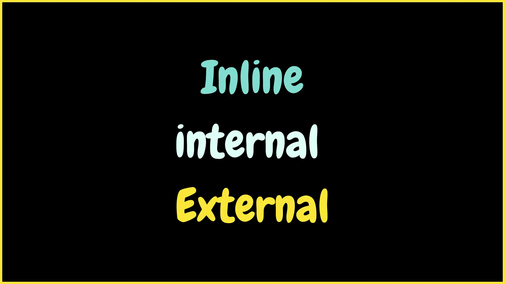

> 🎧 يمكنك الإستماع الي المقالة بدلاً من قراءتها


الـ **CSS** هي لغة التنسيق الخاصة بأكواد **HTML**،  
ومن أهم اللغات اللي لازم تتعلمها لو ناوي تكمل في مجال **الفرونت إند**.

وكمان، من رأيي حتى لو كنت ناوي تكمّل في مجال **الباك إند** أو تبقى **فل ستاك**،  
لازم يكون عندك على الأقل **أساسيات CSS**.  
لإنك هتحتاجها أكيد في مشاريع صغيرة،  
أو حتى لما تيجي تعدّل على أكواد قديمة في مشروع شغال عليه فريق تاني.

**بس خد بالك:**  
لو دي أول مرة تزور موقعنا **CodeZelo**،  
ومعندكش خلفية عن برمجة الويب،  
ابدأ الأول [بدورة **HTML من الصفر**](/series/html-tutorial)،  
علشان تبني الأساس الصح قبل ما تدخل على CSS.

دلوقتي بقى نبدأ بتعريف بسيط للـ **CSS**،  
وبعد كده هنعرف **إزاي نستخدمها مع HTML**،  
وطرق **ربط ملف CSS بملف HTML**.



## تعريف الـCSS وليه بنستخدمها؟

الـ **CSS** هي اختصار لـ **Cascading Style Sheets**،  
ومعناها بالعربي "صفحات الأنماط المتتابعة".

ببساطة، دي اللغة اللي بنستخدمها **علشان ننسّق شكل صفحة الويب** اللي بنكتبها بـ **HTML**.  
يعني HTML بتحدد المحتوى (العناوين، النصوص، الصور...)،  
لكن الـ CSS هي اللي بتدي الصفحة **الشكل الجذاب والتصميم** —  
زي الألوان، حجم الخطوط، ترتيب العناصر، والتباعد بينهم.

تقدر تقول إن:

- لغة **HTML** = هيكل الصفحة
- لغة **CSS** = شكل وتصميم الصفحة

**عشان نفهم ببساطة:**  
الـHTML لوحدها بتعرض النص بشكل عادي جدًا،  
لكن لما تضيف CSS، تقدر تغيّر اللون، الخلفية، وتخلي الصفحة شكلها احترافي.

## طرق استخدام وربط CSS بصفحة HTML


علشان نستخدم الـ **CSS** في تنسيق أكواد الـ HTML عندنا 3 طرق أساسية: **Inline، Internal، External**. كل طريقة ليها استخداماتها ومميزات وعيوب. نبدأ واحدة واحدة.

### 1. Inline Style — استخدام التنسيقات داخل الوسم (مش الأفضل عادةً)

دي أبسط طريقة: بتحط خصائص الـ CSS جوه سمة `style` عند أي وسم HTML. مناسبة لتجارب سريعة أو تعديل طارئ، لكن مش مناسبة لمشروعات حقيقية.

**مثال:**

```html
<!DOCTYPE html>
<html>
  <head>
    <meta charset="utf-8" />
    <title>مثال Inline</title>
  </head>
  <body>
    <h1>الطريقة الأولى: استخدام style داخل الوسم</h1>
    <p style="color: blue;">الفقرة باللون الأزرق</p>
  </body>
</html>
```

**ليه الطريقة دي مش الأفضل؟**

- لو عندك عناصر كتير محتاجة نفس التنسيق هتكرر الكود — وده بيخلي الصيانة صعبة.
- لو حبّيت تغيّر لون أو خط الموقع كله، هتحتاج تعدّل كل سمة `style` في كل وسم HTML.
- بيخلّي الـ HTML ملخبط وصعب القراءة.

### 2. Internal CSS — تسيب التنسيقات في نفس ملف الـ HTML داخل `<style>`

بتحط قواعد الـ CSS داخل وسم `<style>` في رأس الصفحة (`<head>`). مفيدة لو الصفحة وحيدة والستايل بسيط.

**مثال:**

```html
<!DOCTYPE html>
<html>
  <head>
    <meta charset="utf-8" />
    <title>مثال Internal</title>
    <style>
      body {
        font-family: Arial, sans-serif;
      }
      h1 {
        color: #2c3e50;
      }
      p {
        color: blue;
      }
    </style>
  </head>
  <body>
    <h1>الطريقة الثانية: Internal CSS</h1>
    <p>الفقرة باللون الأزرق من ملف الـ &lt;style&gt; داخل الـ head.</p>
  </body>
</html>
```

**مميزات وعيوب الطريقة دي:**

- أسهل لتنظيم قواعد الـCSS لو صفحة HTML وحيدة.
- لكن لو عندك موقع فيه صفحات كتير، هيتكرر نفس الكود في كل صفحة — وده مش عملي.

### 3. External CSS — فصل ملف الـ CSS وربطه بملف الـ HTML (الأفضل عادةً)

أفضل طريقة للمشروعات الحقيقية: بتكتب كل قواعد الـ CSS في ملف منفصل (`styles.css`) مثلاً وتربطه في `<head>` عن طريق إننا هنستخدم وسم `<link>`. والطريقة دي بتدينا سهولة في الصيانة وإعادة الاستخدام وتحسين الأداء (الكاش) من أهم مزاياها.

**ملف `styles.css`:**

```css
/* styles.css */
body {
  font-family: Arial, sans-serif;
}
h1 {
  color: #2c3e50;
}
p {
  color: blue;
}
```

**ربطه في ملف HTML:**

```html
<!DOCTYPE html>
<html>
  <head>
    <meta charset="utf-8" />
    <title>مثال External</title>
    <link rel="stylesheet" href="styles.css" />
  </head>
  <body>
    <h1>الطريقة الثالثة: External CSS</h1>
    <p>الفقرة لونها من ملف CSS منفصل.</p>
  </body>
</html>
```

**ليه External Style هي الأفضل؟**

- تقدر تغيّر التصميم من مكان واحد لكل صفحات الموقع.
- تحسين الأداء لأن الملف ممكن يتخزّن (cached) عند الزوار.
- ينظّم المشروع ويخلي الكود أنظف وأسهل للصيانة.

**رأيي من الآخر:**  
استخدم **الطريقة التالتة (External CSS)** حتى لو مشروعك بسيط.  
لإنك لما تتعود من البداية على **الطريقة الصح**، هتفضل دايمًا تكتب كود **منظّم وسهل التطوير** بعدين.  
وده اللي هيفرق بينك وبين المبتدئ اللي بيحط كل حاجة في سطر واحد.
