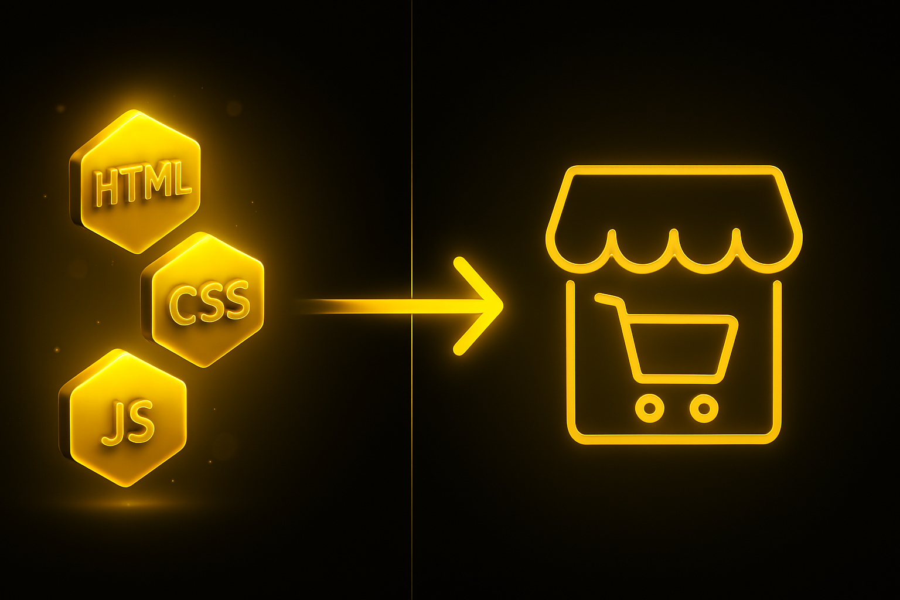
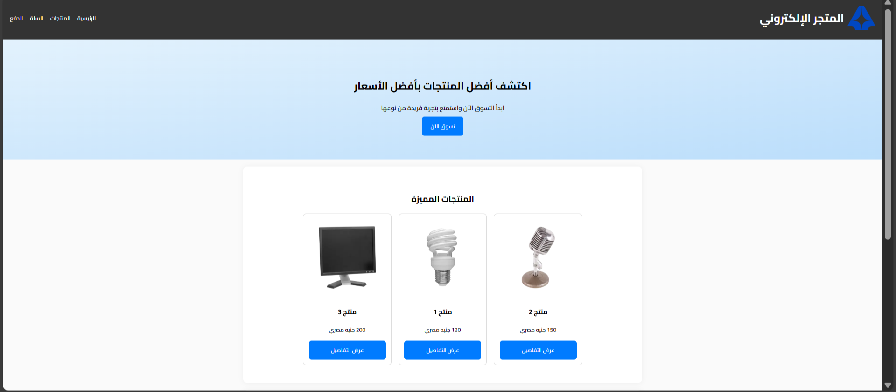
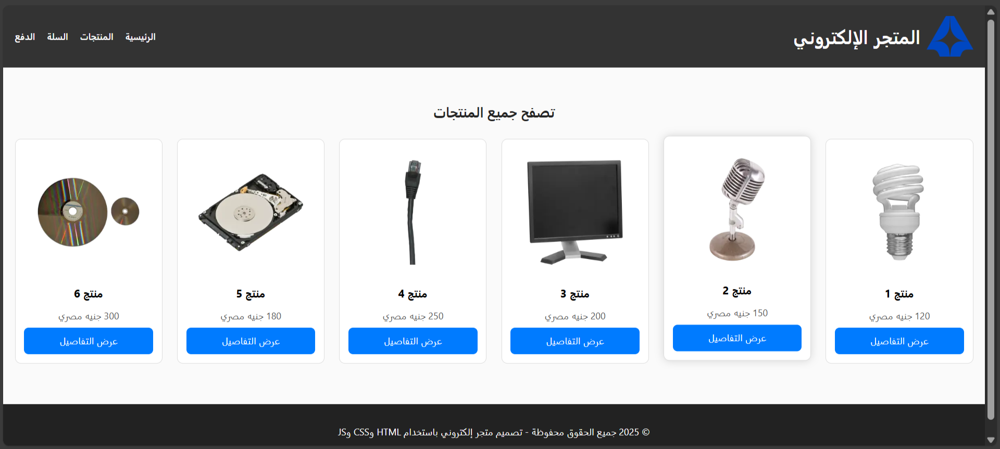
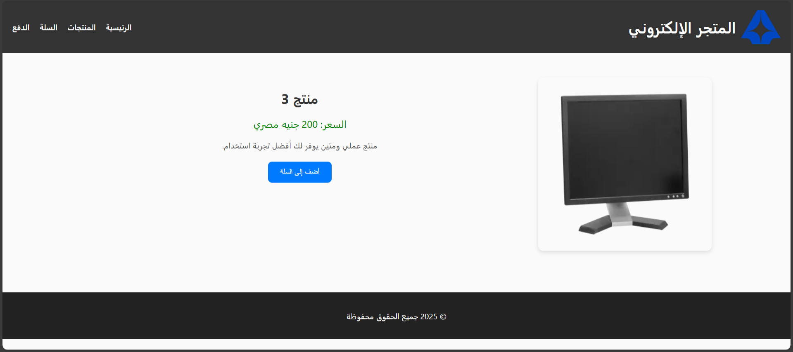
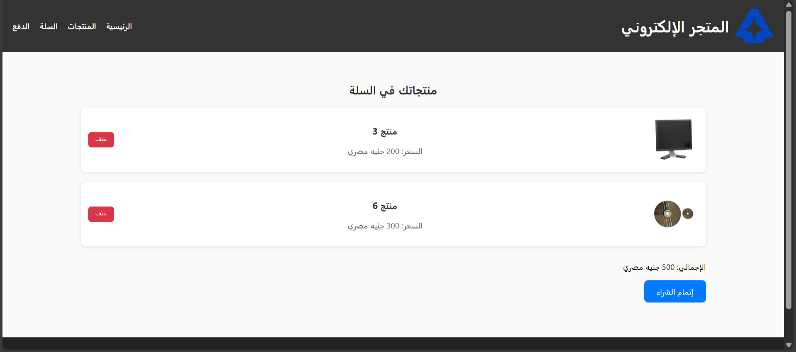
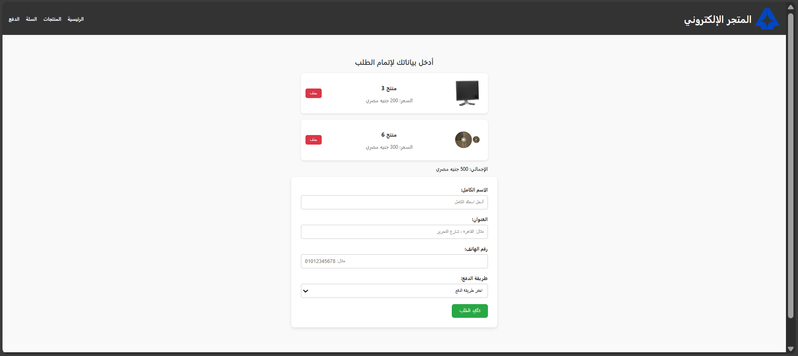

سنتعلّم معًا في هذه الدورة كيف تصمّم وتبني متجرًا إلكترونيًا بسيطًا واحترافيًا باستخدام **HTML وCSS وJavaScript** فقط، وبالاعتماد على الأدوات البسيطة التي يحتاجها أي مطوّر ويب مبتدئ في مجال برمجة الويب.

سنقوم ببناء المتجر خطوةً بخطوة ليصبح لديك مشروع عملي يمكنك تشغيله وتعديله. ستتعلّم كيف تربط الصفحات ببعضها البعض، وكيف تنسّق كل صفحة بطريقة جمالية باستخدام **CSS**.

بعد قراءة هذا المقال، ستتعلّم **استخدام HTML وCSS وJavaScript** بطريقة عملية من خلال مشروع حقيقي، وليس مجرّد دروس نظرية. وبعد تنفيذ الأكواد بنفسك، ستكون قادرًا على بناء متجر إلكتروني بسيط يحتوي على المميزات الأساسية لأي متجر إلكتروني، مثل عرض المنتجات، والسماح للمستخدم بإضافتها إلى سلة التسوّق، والانتقال إلى صفحة الدفع.

سواء أكنت قد بدأت بالفعل في مجال البرمجة أم ما زلت في بداية طريقك نحو تعلّم تطوير الويب، فهذه الدورة ستكون خطوتك الأولى لفهم الأساسيات التي ستمهّد لك الطريق نحو تطوير مواقع احترافية في المستقبل.



## التعرف على أساسيات بناء المتجر الإلكتروني

في البداية سوف نتكلم عن مكونات المتحر الالكتروني، قبل البدا في كتابة الأكواد ولماذا نحتاج تقسيم المتحر الي عدة صفحات.

الفكرة الأساسية في تصميم المتجر الاكلتروني هو البساطة والتنظيم وبساطة التصميم

__ما هو المتجر الإلكتروني؟__

المتجر الإلكتروني هو موقع ويب يهدف إلى **بيع المنتجات** سواء كانت منتجاتك الخاصة أو منتجات لجهات أخرى.  

المتجر الذي سنبنيه في هذه الدورة سيكون بسيطًا، لأن الهدف الأساسي هو **تعلّم أساسيات HTML وCSS وJavaScript** بشكل عملي وسهل الفهم.

من دون الاعتماد على أي قواعد بيانات أو لغات الباك إند  مثل **PHP** أو **Node.js**.

__الصفحات الأساسية في أي متجر إلكتروني بسيط__

سيتكون المتجر  الالكتروني من خمس صفحات رئيسية:

1. **الصفحة الرئيسية (index.html):**  
   هذه الصفحة هي أول ما يراه المستخدم تعرض مقدمة عن المتجر، وبعض المنتجات العشوائية المميزة، وأقسام البراندات.  

2. **صفحة المنتجات (products.html):**  
    تعرض قائمة بمنتجاتك المتوفرة في المتجر، مع صور وأسعار وأزرار لعرض التفاصيل.

3. **صفحة المنتج الواحد (product.html):**  
    تحتوي على تفاصيل منتج معين: الصورة، الاسم، الوصف، السعر، وزر “أضف إلى السلة”.

4. **صفحة السلة (cart.html):**  
    تُظهر المنتجات التي تمت إضافها للسلة، مع إمكانية إتمام عملية الشراء.

5. **صفحة الدفع (checkout.html):**  
    تحتوي على نموذج بسيط لملء بيانات الشراء وإتمام العملية بالكامل مع ظهور رسالة النجاح.

__هيكل المتجر الالكتروني (Project Structure)__

من الأفضل أن نقوم **بتنظيم ملفات المشروع من البداية**، حتى يسهل علينا التعامل معه لاحقًا، خصوصًا في حال تم **توسيع المشروع** أو إضافة مزيد من الصفحات والوظائف.

لذلك، قم بإنشاء **مجلد جديد باسم** `store`، وضع بداخله المجلدات والملفات التالية:

```
store/
│
├── index.html
├── products.html
├── product.html
├── cart.html
├── checkout.html
│
├── css/
│   └── style.css
│
├── js/
│   ├── main.js
│	└── products.json
│
├── images/
│   └── products
│ 	     └── product-1.webp
│ 	     ....
│   └── brands
│ 	     └── brand-1.png
│ 	     ....
```
__الأدوات اللي هنستخدمها عشان نبني المتجر الإلكتروني__

مش محتاج برامج صعبة ولا حاجة، كل اللي هنحتاجه بسيط جدًا:
- **محرر أكواد خفيف زي VS Code أو Sublime Text**
- **متصفح زي Google Chrome أو Edge**
- **وشوية حماس كده 😄**

هنعتمد بس على شوية حاجات أساسية:
- لغة البناء: **HTML** — دي اللي هنعمل بيها شكل وصفحات المتجر.
- لغة التنسيق: **CSS** — علشان نزبط الألوان والشكل ويطلع الموقع شكله حلو.
- اللغة: **JavaScript (JS)** — دي اللي هتخلي الموقع متفاعل ومليان حركة.
- قاعدة البيانات: **JSON** — هنستخدمها كملف بسيط نخزن فيه بيانات المنتجات، وهتكون بالشكل ده:

```json
[
  {
    "id": 1,
    "name": "منتج 1",
    "price": 120,
    "image": "images/products/product-1.webp",
    "description": "منتج عالي الجودة يتميز بتصميم أنيق وأداء ممتاز."
  },
  {
    "id": 2,
    "name": "منتج 2",
    "price": 150,
    "image": "images/products/product-2.webp",
    "description": "منتج رائع يناسب الاستخدام اليومي بخامات ممتازة."
  },
  {
    "id": 3,
    "name": "منتج 3",
    "price": 200,
    "image": "images/products/product-3.webp",
    "description": "منتج عملي ومتين يوفر لك أفضل تجربة استخدام."
  },
  {
    "id": 4,
    "name": "منتج 4",
    "price": 250,
    "image": "images/products/product-4.webp",
    "description": "منتج مميز بأحدث التقنيات وسعر مناسب."
  },
  {
    "id": 5,
    "name": "منتج 5",
    "price": 180,
    "image": "images/products/product-5.webp",
    "description": "منتج بتصميم عصري وجودة عالية يدوم طويلاً."
  },
  {
    "id": 6,
    "name": "منتج 6",
    "price": 300,
    "image": "images/products/product-6.webp",
    "description": "منتج فاخر بأفضل الخامات والتفاصيل الدقيقة."
  }
]
```

## تصميم الصفحة الرئيسية (Home Page)




الصفحة الرئيسية هي **أول حاجة** الزائر هيشوفها لما يدخل المتجر، علشان كده لازم تكون **بسيطة، منظمة، وشكلها حلو**.

في الجزء ده هنتعلم خطوة بخطوة إزاي نصمّم الصفحة الرئيسية لمتجر إلكتروني باستخدام **HTML وCSS وJavaScript**، وبالطريقة دي تناسب المبتدئين وكمان تبقى جاهزة لمحركات البحث (SEO).

هنقسم الصفحة لأربع أجزاء رئيسية علشان تكون واضحة وسهلة:

1. **القسم الأساسي (Hero Section)** — الجزء اللي بيستقبل الزائر وبيديه فكرة سريعة عن المتجر.
    
2. **قسم المنتجات المميزة (Featured Products)** — هنا نعرض منتجات مميزة أو العروض اللي عايزين نروجها.
    
3. **قسم البراندات (Brands Section)** — لو عندك ماركات أو شراكات، نعرض لوجوهاتهم هنا.
    
4. **قسم إضافي (تواصل معنا أو آراء العملاء)** — مكان نخلي الناس تتواصل معانا أو نعرض رأي العملاء عشان نزود الثقة.

__الهيكل الأساسي للصفحة (HTML)__

الآن، افتح ملف `index.html` واكتب الكود التالي 👇:

```html
<!DOCTYPE html>
<html lang="ar">
  <head>
    <meta charset="UTF-8" />
    <meta name="viewport" content="width=device-width, initial-scale=1.0" />
    <title>المتجر الإلكتروني</title>
    <link rel="stylesheet" href="css/style.css" />
    <link
      href="https://fonts.googleapis.com/css2?family=Cairo:wght@400;600;700&display=swap"
      rel="stylesheet"
    />
  </head>
  <body>
    <!-- ====== الهيدر ====== -->
    <header>
      <div class="logo">
        
        <h1>المتجر الإلكتروني</h1>
      </div>

      <nav id="navbar">
        <a href="index.html">الرئيسية</a>
        <a href="products.html">المنتجات</a>
        <a href="cart.html">السلة</a>
        <a href="checkout.html">الدفع</a>
      </nav>

      <button class="menu-toggle" id="menu-toggle">☰</button>
    </header>

    <!-- ====== القسم الرئيسي ====== -->
    <section class="hero">
      <h2>اكتشف أفضل المنتجات بأفضل الأسعار</h2>
      <p>ابدأ التسوق الآن واستمتع بتجربة فريدة من نوعها</p>
      <a href="products.html" class="btn">تسوق الآن</a>
    </section>

    <!-- ====== قسم المنتجات المميزة ====== -->
    <section class="featured">
      <h2>المنتجات المميزة</h2>
      <div id="featuredProducts" class="product-list"></div>
    </section>

    <!-- ====== قسم البراندات ====== -->
    <section class="brands">
      <h2>البراندات</h2>
      <div class="brand-list">
        
        
        
        
      </div>
    </section>

    <!-- ====== قسم التواصل ====== -->
    <section class="contact">
      <h2>تواصل معنا</h2>
      <p>هل لديك سؤال أو استفسار؟ تواصل معنا الآن!</p>
      <a href="mailto:info@store.com" class="btn">راسلنا عبر البريد</a>
    </section>

    <!-- ====== الفوتر ====== -->
    <footer>
      <p>
        © 2025 جميع الحقوق محفوظة - تصميم متجر إلكتروني باستخدام HTML وCSS وJS
      </p>
    </footer>

    <script src="js/main.js"></script>
  </body>
</html>
```


__شرح الكود خطوة بخطوة (بسيط ومفهوم)__

1. **الهيدر (Header):**  
    ده الجزء اللي فوق الصفحة — فيه اسم المتجر وروابط التنقل الأساسية.  
    معمول بلون خلفية غامق والنص أبيض علشان العنوان يبان كويس. وكمان فيه **لوجو** صغير لمظهر احترافي.
    
2. **القسم الأساسي (Hero Section):**  
    الجزء الكبير اللي بيستقبل الزائر — بيقدم مقدمة جذابة عن المتجر.  
    فيه نص لافت وزر واضح مكتوب عليه **"تسوق الآن"**. لما الزائر يضغط الزر ده، بيروح على صفحة المنتجات علطول.
    
3. **قسم المنتجات المميزة:**  
    هنا بنعرض شوية منتجات كمثال — في الشرح استخدمنا 3 منتجات عشوائية من ملف `products.json`.  
    لكل منتج بنعرض صورة، اسم، وسعر بسيط. الفكرة إن الزائر يشوف المنتجات المشهورة بسرعة.
    
4. **قسم البراندات:**  
    بنعرض لوجوهات أو أسماء الشركات والعلامات التجارية اللي المتجر بيتعامل معاها.  
    ده مهم لأنه **بيعطي ثقة للزائر**—لما يشوف ماركات معروفة يحس إن المتجر موثوق.
    
5. **قسم التواصل:**  
    جزء بسيط فيه طريقة تواصل معاك — غالبًا بنستخدم نموذج صغير أو رابط للإيميل.  
    الهدف إن الزائر يقدر يراسلك بسرعة لو عنده سؤال أو طلب.
    
6. **الفوتر (Footer):**  
    الجزء اللي تحت الصفحة — فيه حقوق النشر وسطر تعريف بسيط بالموقع أو رسالة صغيرة.  
    مهم تحطه في كل صفحة عشان يبقى شكل الموقع كامل ومرتب.

__🎨 تنسيق الصفحة (CSS)__

بعد ما خلّصنا كتابة الهيكل الأساسي، محتاجين نبدأ نجهّز **شكل وتصميم الصفحة** عشان تطلع جذابة وواضحة.

افتح ملف التنسيق اللي اسمه:  
`css/style.css`

وبعدين ضيف فيه الكود اللي جاي دلوقتي 👇

```css
body {
  font-family: "Cairo", sans-serif;
  margin: 0;
  padding: 0;
  direction: rtl;
  text-align: center;
  background-color: #fafafa;
}

/* ====== الهيدر ====== */
header {
  background-color: #333;
  color: white;
  padding: 10px 20px;
  display: flex;
  justify-content: space-between;
  align-items: center;
  flex-wrap: wrap;
}

.logo {
  display: flex;
  align-items: center;
  gap: 10px;
}

.logo img {
  border-radius: 8px;
}

nav {
  display: flex;
  gap: 20px;
}

nav a {
  color: white;
  text-decoration: none;
  font-weight: 600;
  transition: color 0.3s;
}

nav a:hover {
  color: #00bfff;
}

/* زر القائمة للجوال */
.menu-toggle {
  display: none;
  background: none;
  border: none;
  color: white;
  font-size: 26px;
  cursor: pointer;
}

/* ====== البطل ====== */
.hero {
  background: linear-gradient(to bottom right, #e3f2fd, #bbdefb);
  padding: 80px 20px;
}

.hero h2 {
  font-size: 30px;
  margin-bottom: 10px;
}

.hero p {
  font-size: 18px;
  margin-bottom: 20px;
}

.btn {
  background-color: #007bff;
  color: white;
  padding: 12px 25px;
  border-radius: 8px;
  text-decoration: none;
  transition: 0.3s;
  cursor: pointer;
}

.btn:hover {
  background-color: #0056b3;
}

/* ====== المنتجات ====== */
.featured,
.brands,
.contact {
  padding: 50px 20px;
  background-color: white;
  margin: 20px auto;
  border-radius: 12px;
  width: 90%;
  max-width: 1100px;
  box-shadow: 0 0 15px rgba(0, 0, 0, 0.05);
}

.product-list {
  display: flex;
  justify-content: center;
  gap: 20px;
  flex-wrap: wrap;
}

.product {
  border: 1px solid #ddd;
  padding: 15px;
  border-radius: 10px;
  width: 220px;
  background-color: #fff;
  transition: 0.3s;
}

.product img {
  width: 100%;
  border-radius: 8px;
}

.product .btn {
  display: block;
}
.product:hover {
  transform: translateY(-5px);
  box-shadow: 0 0 15px rgba(0, 0, 0, 0.1);
}

/* ====== البراندات ====== */
.brand-list {
  display: flex;
  justify-content: space-around;
  align-items: center;
  gap: 25px;
  flex-wrap: wrap;
}

.brand-list img {
  opacity: 0.8;
  transition: 0.3s;
}

.brand-list img:hover {
  opacity: 1;
}

/* ====== الفوتر ====== */
footer {
  background: #222;
  color: #fff;
  padding: 20px 0;
  margin-top: 30px;
}


/* ====== تجاوب الشاشات ====== */
@media (max-width: 768px) {
  nav {
    display: none;
    flex-direction: column;
    width: 100%;
    background-color: #444;
    padding: 10px 0;
  }

  nav.active {
    display: flex;
  }

  .menu-toggle {
    display: block;
  }

  .product-list {
    flex-direction: column;
    align-items: center;
  }
}
```

 __أكواد JavaScript الخاصة بشريط التنقّل__

بعد ما خلّصنا كتابة هيكل الصفحة ونسّقناها بشكل جميل،  
دلوقتي جه وقت نضيف شوية أكواد JavaScript علشان نخلي الموقع **يتحرّك ويتفاعل**.

افتح ملف:  
`js/main.js`  
وضيف الكود اللي جاي دلوقتي 👇

```js
document.addEventListener("DOMContentLoaded", function () {
  const toggle = document.getElementById("menu-toggle");
  const navbar = document.getElementById("navbar");
  toggle.addEventListener("click", () => {
    navbar.classList.toggle("active");
  });

  // جلب عنصر القائمة
  const featuredContainer = document.getElementById("featuredProducts");

  if (featuredContainer) {
    // جلب بيانات المنتجات من ملف JSON
    fetch("js/products.json")
      .then((response) => response.json())
      .then((products) => {
        // اختيار 3 منتجات عشوائية
        const randomProducts = products
          .sort(() => 0.5 - Math.random())
          .slice(0, 3);

        // إنشاء كود HTML لكل منتج
        const html = randomProducts
          .map(
            (p) => `
        <div class="product">
          
          <h3>${p.name}</h3>
          <p>${p.price} جنيه مصري</p>
          <a href="product.html?id=${p.id}" class="btn">عرض التفاصيل</a>
        </div>
      `
          )
          .join("");

        // عرضها داخل الصفحة
        featuredContainer.innerHTML = html;
      })
      .catch(() => {
        featuredContainer.innerHTML = "<p>حدث خطأ أثناء تحميل المنتجات.</p>";
      });
  }
});
```

- الكود ده مسؤول عن **فتح وقفل القائمة** لما الموقع يشتغل على **شاشات الموبايل أو الشاشات الصغيرة**،  
    يعني لما الزائر يضغط على أيقونة القائمة، تظهر أو تختفي.
    
- وكمان بيقوم **بجلب 3 منتجات عشوائية** من ملف المنتجات (`products.json`)  
    ويعرضهم في القسم اللي اسمه **المنتجات المميزة**، عشان الصفحة تبان دايمًا متجددة وجذابة.

## تصميم صفحة المنتجات (Products Page)



في الجزء ده هنتعلم **إزاي نصمّم صفحة المنتجات باستخدام HTML وCSS وJavaScript**،  
بطريقة سهلة وبسيطة علشان تناسب أي حد لسه بيتعلم.

صفحة المنتجات دي مهمة لأنها بتساعد الزائر **يتصفح كل العناصر الموجودة في المتجر بسهولة**،  
ويشوف الأسعار والصور، وكمان يدخل على تفاصيل المنتج بضغطة زر واحدة.

الصفحة هتتكوّن من:

- عنوان واضح في أولها.
    
- شبكة من الكروت (Cards) لعرض المنتجات.
    
- زر بيعرض تفاصيل كل منتج.
    
- تصميم متجاوب يشتغل على كل الأجهزة (كمبيوتر – موبايل – تابلت).

__كود صفحة المنتجات (HTML)__

افتح الملف `products.html` داخل مجلد المشروع،  
واكتب الكود اللي هنشرحه دلوقتي 👇

```html
<!DOCTYPE html>
<html lang="ar">
  <head>
    <meta charset="UTF-8" />
    <meta name="viewport" content="width=device-width, initial-scale=1.0" />
    <title>المنتجات - المتجر الإلكتروني</title>
    <link rel="stylesheet" href="css/style.css" />
  </head>
  <body>
    <!-- ====== الهيدر ====== -->
    <header>
      <div class="logo">
        
        <h1>المتجر الإلكتروني</h1>
      </div>

      <nav id="navbar">
        <a href="index.html">الرئيسية</a>
        <a href="products.html">المنتجات</a>
        <a href="cart.html">السلة</a>
        <a href="checkout.html">الدفع</a>
      </nav>

      <button class="menu-toggle" id="menu-toggle">☰</button>
    </header>

    <!-- ====== قسم عرض المنتجات ====== -->
    <section class="products-page">
      <h2>تصفح جميع المنتجات</h2>

      <div id="productsContainer" class="product-grid"></div>
    </section>

    <footer>
      <p>
        © 2025 جميع الحقوق محفوظة - تصميم متجر إلكتروني باستخدام HTML وCSS وJS
      </p>
    </footer>

    <script src="js/main.js"></script>
  </body>
</html>
```

__شرح الكود خطوة بخطوة__

1. **الهيدر (Header):**  
    نفس الهيدر اللي استخدمناه في الصفحة الرئيسية،  
    علشان نحافظ على الشكل العام والتناسق بين كل الصفحات.
    
2. **العنوان الرئيسي:**  
    استخدمنا العنصر `<h2>` لكتابة جملة “تصفح جميع المنتجات”.  
    العنوان ده كمان بيساعد في **تحسين السيو (SEO)** لأنه بيقول لجوجل إن دي صفحة منتجات.
    
3. **شبكة المنتجات (Product Grid):**  
    استخدمنا **CSS Grid** علشان نوزّع المنتجات في صفوف وأعمدة بشكل متجاوب.  
    كده الموقع هيعرض منتجين أو تلاتة في الصف الواحد حسب حجم الشاشة.
    
4. **تصميم المنتج (Product Card):**  
    كل منتج عبارة عن كارت فيه **صورة، اسم، سعر، وزر مكتوب عليه "عرض التفاصيل"**.  
    لما تمرر الماوس فوق الكارت، بيظهر تأثير بسيط زي ظل خفيف أو حركة ناعمة.
    
5. **زر عرض التفاصيل:**  
    الزر ده بيعتمد على **id** الخاص بكل منتج،  
    علشان لما المستخدم يضغط عليه، يروح على صفحة تفاصيل المنتج اللي تخصه.
    
6. **التصميم المتجاوب (Responsive Design):**  
    بفضل السطر ده:  
    `grid-template-columns: repeat(auto-fit, minmax(220px, 1fr));`  
    الصفحة هتتأقلم تلقائيًا مع أي شاشة — سواء كمبيوتر أو موبايل أو تابلت.

__🎨 تنسيق صفحة المنتجات (CSS)__

دلوقتي افتح ملف:  
`css/style.css`  
وضيف الأكواد الجديدة في آخر الملف علشان تضبط تصميم صفحة المنتجات وتخلي شكلها منسّق وجذاب.

```css
.products-page {
  padding: 40px 20px;
  background-color: #fafafa;
}

.products-page h2 {
  margin-bottom: 30px;
  color: #222;
}

.product-grid {
  display: grid;
  grid-template-columns: repeat(auto-fit, minmax(220px, 1fr));
  gap: 25px;
  justify-items: center;
}

.product-grid .product {
  background-color: white;
  border: 1px solid #ddd;
  border-radius: 10px;
  padding: 15px;
  transition: transform 0.3s, box-shadow 0.3s;
}

.product-grid .product:hover {
  transform: translateY(-5px);
  box-shadow: 0 0 15px rgba(0, 0, 0, 0.15);
}

.product-grid img {
  width: 100%;
  border-radius: 10px;
}

.product-grid h3 {
  margin: 10px 0 5px;
}

.product-grid p {
  color: #555;
  margin-bottom: 10px;
}
```

 __أكواد JavaScript__

أخيرًا، افتح ملف:  
`js/main.js`  
وضيف الكود اللي هيقوم **بجلب المنتجات من ملف `products.json`**  
وعرضها جوه صفحة المنتجات بشكل تلقائي.

```js
document.addEventListener("DOMContentLoaded", function () {
  // الكود السابق مثل ما هو
  // جلب عنصر القائمة
  const productsContainer = document.getElementById("productsContainer");

  if (productsContainer) {
    // جلب بيانات المنتجات من ملف JSON
    fetch("js/products.json")
      .then((response) => response.json())
      .then((products) => {
        // إنشاء كود HTML لكل منتج
        const html = products
          .map(
            (p) => `
        <div class="product">
          
          <h3>${p.name}</h3>
          <p>${p.price} جنيه مصري</p>
          <a href="product.html?id=${p.id}" class="btn">عرض التفاصيل</a>
        </div>
      `
          )
          .join("");

        // عرضها داخل الصفحة
        productsContainer.innerHTML = html;
      })
      .catch(() => {
        productsContainer.innerHTML = "<p>حدث خطأ أثناء تحميل المنتجات.</p>";
      });
  }
});
```

## صفحة تفاصيل المنتج (Product Page)



في الصفحة دي، هنعرِض كل المعلومات المهمة عن المنتج، زي:

- صورة المنتج
- اسم المنتج
- السعر
- وصف بسيط
- وزر مكتوب عليه **"أضف إلى السلة"**

الصفحة دي بتساعد المستخدم يعرف تفاصيل أكتر عن المنتج قبل ما يشتريه.

هيكل الصفحة باستخدام HTML__

هنبدأ نعمل ملف جديد اسمه:  
`product.html`  
جواه هنكتب الكود اللي هيكوّن شكل صفحة تفاصيل المنتج.

الكود هيحتوي على مكان لصورة المنتج، الاسم، السعر، الوصف، وزر الإضافة للسلة.

```html
<!DOCTYPE html>
<html lang="ar">
  <head>
    <meta charset="UTF-8" />
    <meta name="viewport" content="width=device-width, initial-scale=1.0" />
    <title>تفاصيل المنتج | المتجر الإلكتروني</title>
    <link rel="stylesheet" href="css/style.css" />
  </head>
  <body>
    <!-- ====== الهيدر ====== -->
    <header>
      <div class="logo">
        
        <h1>المتجر الإلكتروني</h1>
      </div>

      <nav id="navbar">
        <a href="index.html">الرئيسية</a>
        <a href="products.html">المنتجات</a>
        <a href="cart.html">السلة</a>
        <a href="checkout.html">الدفع</a>
      </nav>

      <button class="menu-toggle" id="menu-toggle">☰</button>
    </header>

    <main class="product-page">
      <div id="productContainer" class="product-container">
        <p>جاري تحميل تفاصيل المنتج...</p>
      </div>
    </main>

    <footer>
      <p>© 2025 جميع الحقوق محفوظة</p>
    </footer>

    <script src="js/main.js"></script>
  </body>
</html>
```

🎨 __تنسيق الصفحة باستخدام CSS__

بعد ما نكتب الهيكل، نروح نفتح ملف التنسيق:  
`css/style.css`  
ونضيف في آخره شوية أكواد جديدة لتنسيق صفحة تفاصيل المنتج.  
الأكواد دي هتخلي الصفحة شكلها منظم، والمنتج واضح ومركّز عليه.

```css
.product-page {
  padding: 50px 10%;
  background-color: #fafafa;
}

.product-container {
  display: flex;
  flex-wrap: wrap;
  gap: 40px;
  align-items: flex-start;
}

.product-image img {
  width: 350px;
  border-radius: 10px;
  box-shadow: 0 4px 8px rgba(0,0,0,0.1);
}

.product-details {
  flex: 1;
  min-width: 300px;
}

.product-details h2 {
  font-size: 28px;
  margin-bottom: 10px;
  color: #333;
}

.product-details .price {
  font-size: 20px;
  color: #008000;
  margin-bottom: 15px;
}

.product-details .description {
  color: #555;
  line-height: 1.7;
  margin-bottom: 20px;
}

button#addToCartBtn {
  padding: 12px 25px;
  background-color: #007bff;
  color: white;
  border: none;
  border-radius: 8px;
  cursor: pointer;
  font-size: 16px;
  transition: background 0.3s;
}

button#addToCartBtn:hover {
  background-color: #0056b3;
}
```

__إضافة كود JavaScript__

دلوقتي هنضيف جزء الجافاسكريبت في الملف:  
`js/main.js`

الأكواد دي وظيفتها حاجتين رئيسيين:

1. **قراءة الـID الخاص بالمنتج** من رابط الصفحة علشان نقدر نجيب تفاصيل المنتج اللي المستخدم ضغط عليه.
    
2. **تفعيل زر “أضف إلى السلة”** — لما المستخدم يضغط عليه، بتظهر رسالة تأكيد إن المنتج اتضاف بنجاح.

```js
document.addEventListener("DOMContentLoaded", function () {
  //  نفس الكود السابق
  // قراءة ID المنتج من الرابط
  const params = new URLSearchParams(window.location.search);
  const productId = parseInt(params.get("id"));

  // عنصر الصفحة (تأكد من أن id في HTML هو "product-container")
  const productContainer = document.getElementById("productContainer");

  if (productContainer) {
    fetch("js/products.json")
      .then((response) => response.json())
      .then((data) => {
        const product = data.find((p) => p.id === productId);

        if (product) {
          productContainer.innerHTML = `
          <div class="product-image">
            
          </div>
          <div class="product-details">
            <h2>${product.name}</h2>
            <p class="price">السعر: ${product.price} جنيه مصري</p>
            <p class="description">${product.description}</p>
            <button id="addToCartBtn" class="btn">أضف إلى السلة</button>
          </div>
        `;

          // عند الضغط على زر "أضف إلى السلة"
          const addToCartBtn = document.getElementById("addToCartBtn");

          if (addToCartBtn) {
            addToCartBtn.addEventListener("click", function () {
              const productObj = {
                name: product.name,
                price: product.price,
                image: product.image,
              };

              // نحصل على السلة الحالية من localStorage
              let cart = JSON.parse(localStorage.getItem("cart")) || [];

              // نضيف المنتج الجديد
              cart.push(productObj);

              // نحفظها مرة تانية
              localStorage.setItem("cart", JSON.stringify(cart));

              alert("تمت إضافة المنتج إلى السلة!");
            });
          }
        } else {
          productContainer.innerHTML = `<p>المنتج رقم ${productId} غير موجود.</p>`;
        }
      })
      .catch(() => {
        productContainer.innerHTML = "<p>حدث خطأ أثناء تحميل البيانات.</p>";
      });
  }
});
```

💡 الفكرة بسيطة جدًا:  
لما الزائر يضغط على زر "أضف إلى السلة"، بيظهر له تنبيه إن المنتج اتسجّل.  
وفي الخطوات الجاية (لما نوصل لصفحة السلة)، هنخلي الزر ده يضيف المنتج فعليًا جوه `localStorage`،  
علشان المنتج يظهر جوه سلة المشتريات فعلاً.

## صفحة السلة (Cart Page)



صفحة **السلة** هي المكان اللي المستخدم بيشوف فيه كل المنتجات اللي أضافها علشان يشتريها،  
وبيظهر فيها تفاصيل زي **السعر**، **الكمية**، وزر لحذف أي منتج أو متابعة عملية الشراء.

في الجزء ده، هنعمل **نسخة بسيطة وسهلة جدًا** من صفحة السلة،  
علشان تكون واضحة للمبتدئين وسهلة في التطوير بعدين لما تحب تضيف مميزات أكتر.

الهيكل الأساسي للصفحة (HTML)__

افتح ملف اسمه:  
`cart.html`  
وجواه هنضيف كود صفحة السلة اللي فيه العناصر الأساسية:
- عنوان الصفحة.
- جدول أو كروت المنتجات اللي اتضافت.
- السعر الإجمالي.
- وأزرار التحكم (زي حذف المنتج أو متابعة الشراء).
    
```html
<!DOCTYPE html>
<html lang="ar">
  <head>
    <meta charset="UTF-8" />
    <meta name="viewport" content="width=device-width, initial-scale=1.0" />
    <title>سلة المشتريات | متجر بسيط</title>
    <link rel="stylesheet" href="css/style.css" />
  </head>
  <body>
    <!-- ====== الهيدر ====== -->
    <header>
      <div class="logo">
        
        <h1>المتجر الإلكتروني</h1>
      </div>

      <nav id="navbar">
        <a href="index.html">الرئيسية</a>
        <a href="products.html">المنتجات</a>
        <a href="cart.html">السلة</a>
        <a href="checkout.html">الدفع</a>
      </nav>

      <button class="menu-toggle" id="menu-toggle">☰</button>
    </header>

    <!-- محتوى الصفحة -->
    <main class="cart-page">
      <h2>منتجاتك في السلة</h2>

      <div id="cart-items">
        <!-- سيتم إضافة المنتجات هنا عبر JavaScript -->
      </div>

      <div class="cart-summary">
        <p id="total-price">الإجمالي: 0 جنيه مصري</p>
        <a href="checkout.html" class="checkout-btn">إتمام الشراء</a>
      </div>
    </main>

    <!-- ذيل الصفحة -->
    <footer>
      <p>© 2025 متجر بسيط - جميع الحقوق محفوظة</p>
    </footer>

    <script src="js/main.js"></script>
  </body>
</html>
```

__🎨 تنسيق صفحة السلة (CSS)__

بعد ما نخلص الهيكل، افتح ملف التنسيق:  
`css/style.css`  
وانزل لآخر الملف وضيف الأكواد الخاصة بتنسيق صفحة السلة.

الأكواد دي هتظبط شكل الصفحة،  
تخليها مرتبة وواضحة — بحيث الزائر يعرف الأسعار، الكمية، والإجمالي بسهولة.

```css
.cart-page {
  padding: 40px 10%;
  background-color: #fafafa;
}

.cart-page h2 {
  margin-bottom: 20px;
  color: #333;
}

#cart-items {
  display: flex;
  flex-direction: column;
  gap: 20px;
}

.cart-item {
  display: flex;
  justify-content: space-between;
  align-items: center;
  padding: 15px;
  background-color: white;
  border-radius: 10px;
  box-shadow: 0 2px 6px rgba(0,0,0,0.1);
}

.cart-item img {
  width: 100px;
  border-radius: 8px;
}

.cart-item-info {
  flex: 1;
  margin-left: 15px;
}

.cart-item-info h3 {
  margin-bottom: 5px;
  color: #333;
}

.cart-item-info p {
  color: #666;
}

.remove-btn {
  padding: 8px 15px;
  background-color: #dc3545;
  color: white;
  border: none;
  border-radius: 6px;
  cursor: pointer;
  transition: background 0.3s;
}

.remove-btn:hover {
  background-color: #b02a37;
}

.cart-summary {
  margin-top: 30px;
  text-align: right;
}

.checkout-btn {
  display: inline-block;
  padding: 12px 25px;
  background-color: #007bff;
  color: white;
  text-decoration: none;
  border-radius: 8px;
  transition: background 0.3s;
}

.checkout-btn:hover {
  background-color: #0056b3;
}
```

__تفعيل السلة باستخدام JavaScript و localStorage__

الخطوة دي هي اللي هتخلي السلة **تشتغل فعلاً**.

هنفتح ملف الجافاسكريبت:  
`js/main.js`
ونضيف كود بسيط بيقوم بوظايف مهمة:

```js
document.addEventListener("DOMContentLoaded", function () {
  // الكود مثل ما سبق
  // عرض المنتجات في صفحة السلة
  const cartItemsContainer = document.getElementById("cart-items");

  if (cartItemsContainer) {
    const cart = JSON.parse(localStorage.getItem("cart")) || [];

    if (cart.length === 0) {
      cartItemsContainer.innerHTML = "<p>السلة فارغة حاليًا.</p>";
    } else {
      let total = 0;

      cart.forEach((item, index) => {
        total += item.price;

        const cartItem = document.createElement("div");
        cartItem.classList.add("cart-item");
        cartItem.innerHTML = `
        
        <div class="cart-item-info">
          <h3>${item.name}</h3>
          <p>السعر: ${item.price} جنيه مصري</p>
        </div>
        <button class="remove-btn" data-index="${index}">حذف</button>
      `;
        cartItemsContainer.appendChild(cartItem);
      });

      // تحديث الإجمالي
      document.getElementById(
        "total-price"
      ).textContent = `الإجمالي: ${total} جنيه مصري`;

      // وظيفة حذف منتج من السلة
      const removeButtons = document.querySelectorAll(".remove-btn");
      removeButtons.forEach((btn) => {
        btn.addEventListener("click", (e) => {
          const index = e.target.getAttribute("data-index");
          cart.splice(index, 1);
          localStorage.setItem("cart", JSON.stringify(cart));
          location.reload();
        });
      });
    }
  }
});
```

- لما المستخدم يضغط على **"أضف إلى السلة"** في صفحة المنتج،  
    المنتج بيتسجّل جوه `localStorage`.
    
- في صفحة السلة (`cart.html`)، بنقرأ البيانات دي من `localStorage`  
    ونعرِض المنتجات اللي المستخدم اختارها.
    
- لو السلة فاضية، بتظهر رسالة لطيفة تقول **"السلة فاضية"**.
    
- الكود كمان بيحسب **الإجمالي (Total Price)** بشكل تلقائي.
    
- ولو المستخدم ضغط على زر “حذف”، المنتج بيتشال فورًا من السلة والصفحة بتتحدّث تلقائيًا.

🧩 **الخطوة الجاية:**  
بعد ما تظبط صفحة السلة، آخر حاجة هنعملها هي **صفحة الدفع (Checkout Page)**  
علشان نكمّل المتجر الإلكتروني بالكامل من الألف للياء

## صفحة الدفع (Checkout Page)



صفحة **الدفع** هي الصفحة اللي المستخدم بيكمّل فيها عملية الشراء.  
هنا هيكتب بياناته زي:

- الاسم
- العنوان
- رقم الموبايل
- واختيار طريقة الدفع

حتى لو المشروع بتاعنا بسيط ومش متوصل بقاعدة بيانات حقيقية،  
الخطوة دي مهمة جدًا علشان نتعلم إزاي نعمل **نموذج (Form)** كامل من البداية للنهاية.


__هيكل صفحة الدفع (HTML)__

افتح ملف جديد في مجلد المشروع باسم:  
`checkout.html`  
وجواه هتكتب الكود اللي بيعمل هيكل الصفحة،  
واللي بيحتوي على:

- نموذج فيه حقول البيانات (الاسم – العنوان – رقم الموبايل – طريقة الدفع)
    
- وزر “تأكيد الطلب”

```html
<!DOCTYPE html>
<html lang="ar">
  <head>
    <meta charset="UTF-8" />
    <meta name="viewport" content="width=device-width, initial-scale=1.0" />
    <title>إتمام الشراء | متجر بسيط</title>
    <link rel="stylesheet" href="css/style.css" />
  </head>
  <body>
    <!-- ====== الهيدر ====== -->
    <header>
      <div class="logo">
        
        <h1>المتجر الإلكتروني</h1>
      </div>

      <nav id="navbar">
        <a href="index.html">الرئيسية</a>
        <a href="products.html">المنتجات</a>
        <a href="cart.html">السلة</a>
        <a href="checkout.html">الدفع</a>
      </nav>

      <button class="menu-toggle" id="menu-toggle">☰</button>
    </header>

    <!-- محتوى الصفحة -->
    <main class="checkout-page">
      <div id="confirmation-message"></div>
      <h2>أدخل بياناتك لإتمام الطلب</h2>

      <div id="cart-items">
        <!-- سيتم إضافة المنتجات هنا عبر JavaScript -->
      </div>

      <div id="cart-summary" class="cart-summary">
        <p id="total-price">الإجمالي: 0 جنيه مصري</p>
      </div>

      <form id="checkoutForm">
        <div class="form-group">
          <label for="name">الاسم الكامل:</label>
          <input
            type="text"
            id="name"
            name="name"
            required
            placeholder="أدخل اسمك الكامل"
          />
        </div>

        <div class="form-group">
          <label for="address">العنوان:</label>
          <input
            type="text"
            id="address"
            name="address"
            required
            placeholder="مثال: القاهرة - شارع التحرير"
          />
        </div>

        <div class="form-group">
          <label for="phone">رقم الهاتف:</label>
          <input
            type="tel"
            id="phone"
            name="phone"
            required
            placeholder="مثال: 01012345678"
          />
        </div>

        <div class="form-group">
          <label for="payment">طريقة الدفع:</label>
          <select id="payment" name="payment" required>
            <option value="">اختر طريقة الدفع</option>
            <option value="cash">الدفع عند الاستلام</option>
            <option value="card">بطاقة بنكية</option>
          </select>
        </div>

        <button type="submit" class="submit-btn">تأكيد الطلب</button>
      </form>
    </main>

    <!-- ذيل الصفحة -->
    <footer>
      <p>© 2025 متجر بسيط - جميع الحقوق محفوظة</p>
    </footer>

    <script src="js/main.js"></script>
  </body>
</html>
```

__🎨 تنسيق صفحة الدفع (CSS)__

دلوقتي نفتح ملف التنسيقات:  
`css/style.css`  
وفي آخره نضيف الأكواد الخاصة بتصميم صفحة الدفع.

الأكواد دي هتخلي النموذج شكله أنيق ومنظم،  
بحيث المستخدم يقدر يملأ بياناته بسهولة على أي جهاز — سواء كمبيوتر أو موبايل.

```css
.checkout-page {
  padding: 50px 10%;
  background-color: #f9f9f9;
}

.checkout-page h2 {
  margin-bottom: 20px;
  color: #333;
}

.checkout-page #cart-items,
.checkout-page #cart-summary {
  max-width: 600px;
  margin: auto;
}

form#checkoutForm {
  background-color: white;
  padding: 30px;
  border-radius: 10px;
  box-shadow: 0 4px 10px rgba(0, 0, 0, 0.1);
  max-width: 600px;
  margin: auto;
  text-align: right;
}

.form-group {
  margin-bottom: 20px;
  display: flex;
  flex-direction: column;
}

label {
  margin-bottom: 8px;
  font-weight: bold;
  color: #333;
}

input,
select {
  padding: 12px;
  border: 1px solid #ccc;
  border-radius: 6px;
  font-size: 16px;
}

.submit-btn {
  padding: 12px 25px;
  background-color: #28a745;
  color: white;
  border: none;
  border-radius: 8px;
  cursor: pointer;
  font-size: 18px;
  transition: background 0.3s;
}

.submit-btn:hover {
  background-color: #218838;
}

#confirmation-message {
  display: none;
  padding: 30px;
  margin-top: 30px;
  font-size: 18px;
  background-color: #218838;
  color: #fff;
  text-align: center;
}
```

__كود JavaScript لتأكيد الطلب__

الخطوة الأخيرة هي إضافة كود بسيط في ملف:  
`js/main.js`

```js
document.addEventListener("DOMContentLoaded", function () {
// معالجة نموذج الدفع
  const checkoutForm = document.getElementById("checkoutForm");

  if (checkoutForm) {
    checkoutForm.addEventListener("submit", function (event) {
      event.preventDefault();

      // الحصول على البيانات من النموذج
      const name = document.getElementById("name").value;
      const address = document.getElementById("address").value;
      const phone = document.getElementById("phone").value;
      const payment = document.getElementById("payment").value;

      // التحقق من إدخال البيانات
      if (!name || !address || !phone || !payment) {
        alert("من فضلك أكمل جميع الحقول قبل تأكيد الطلب.");
        return;
      }

      // مسح السلة بعد الإتمام
      localStorage.removeItem("cart");
      cartItemsContainer.innerHTML = "<p>السلة فارغة حاليًا.</p>";
      document.getElementById(
        "total-price"
      ).textContent = `الإجمالي: 0 جنيه مصري`;
      // عرض رسالة تأكيد
      const messageBox = document.getElementById("confirmation-message");
      messageBox.style.display = "block";

      messageBox.innerHTML = `
      <p>🎉 شكرًا لك يا <strong>${name}</strong>!</p>
      <p>تم استلام طلبك بنجاح، وسنقوم بتوصيله إلى: <strong>${address}</strong>.</p>
      <p>طريقة الدفع: <strong>${
        payment === "cash" ? "الدفع عند الاستلام" : "بطاقة بنكية"
      }</strong></p>
    `;

      // إعادة تعيين النموذج
      checkoutForm.reset();
    });
  }
});
```

__الوظيفة بتاعته:__

- لما المستخدم يضغط على زر **“تأكيد الطلب”**،  
    الكود بيمنع الصفحة من إنها تتحدث (`event.preventDefault()`).
    
- بعد كده بيقرأ البيانات اللي المستخدم كتبها.
    
- بيحذف المنتجات من `localStorage` لأن الطلب اتأكد.
    
- وأخيرًا، بيظهر رسالة شكر لطيفة تقول مثلًا:  
    **“تم تأكيد طلبك بنجاح 🎉 شكرًا لاستخدامك متجرنا!”**

وكده تكون خلصت كل صفحات المتجر الإلكتروني بنجاح —  
من الصفحة الرئيسية، لحد صفحة الدفع
مشروع بسيط، منظم، وقابل للتطوير في أي وقت.

__الأكواد علي Github:__
