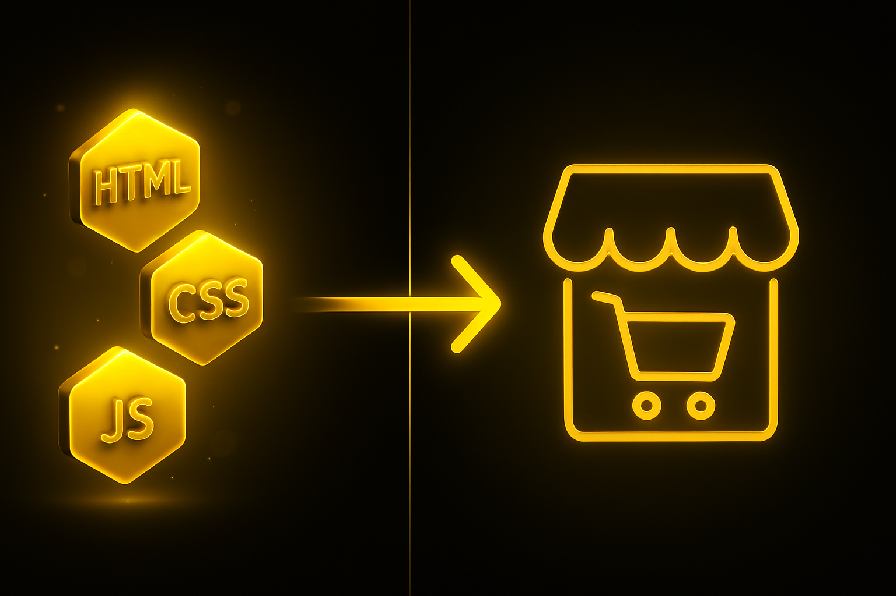
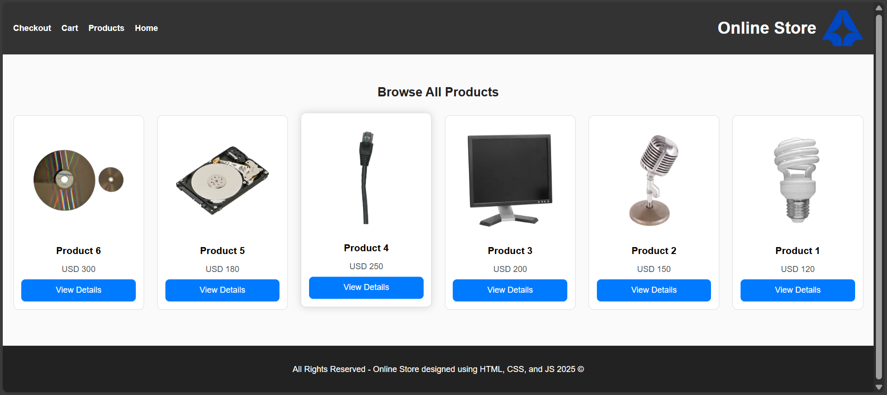

In this course, we’ll learn together how to design and build a simple yet professional online store using only HTML, CSS, and JavaScript—relying on the basic tools every beginner web developer needs to get started in web development.

We’ll build the store step by step so that by the end, you’ll have a fully functional project you can run and customize. You’ll learn how to connect different pages together and style each one beautifully using CSS.

By the end of this article, you’ll know [how to use HTML](/en/categories/resources/basic-html-structure-essential-tags/), CSS, and JavaScript in a practical way through a real project—not just theoretical lessons. After writing the code yourself, you’ll be able to build a simple online store that includes essential features such as displaying products, adding them to a shopping cart, and moving to a checkout page.

Whether you’ve already started learning programming or you’re just taking your first steps into web development, this course will be your first milestone toward understanding the fundamentals that will prepare you to build professional websites in the future.



## Understanding the Basics of Building an Online Store

To begin, let’s talk about the **main components of an online store** before we start writing any code, and why it’s important to divide the store into multiple pages.

The core idea behind designing an online store is **simplicity, organization, and clean design**.

__What Is an Online Store?__

An online store is a website designed to **sell products**, whether they’re your own or those of other sellers.

The store we’ll build in this course will be simple, because the main goal is to **learn the fundamentals of HTML, CSS, and JavaScript** in a practical, easy-to-understand way.

We’ll do this **without relying on any databases or back-end languages** such as **PHP** or **Node.js**.

__The Main Pages of a Simple Online Store__

Our online store will consist of **five main pages**:

1. **Home Page (`index.html`):**
   This is the first page users see. It displays an introduction to the store, a few featured or random products, and some brand sections.

2. **Products Page (`products.html`):**
   Displays a list of all available products in the store, including images, prices, and buttons to view more details.

3. **Single Product Page (`product.html`):**
   Contains detailed information about a specific product — the image, name, description, price, and an “Add to Cart” button.

4. **Cart Page (`cart.html`):**
   Shows the products added to the shopping cart, with the option to proceed to checkout.

5. **Checkout Page (`checkout.html`):**
   Includes a simple form for entering purchase details and completing the order, followed by a success message.


__Project Structure__

It’s best to **organize your project files from the very beginning**, so it’s easier to manage later — especially if you decide to **expand the project** or add more pages and features.

So, start by creating a **new folder named** `store`, and inside it, add the following folders and files:

```
store/
│
├── index.html
├── products.html
├── product.html
├── cart.html
├── checkout.html
│
├── css/
│   └── style.css
│
├── js/
│   ├── main.js
│	└── products.json
│
├── images/
│   └── products
│ 	     └── product-1.webp
│ 	     ....
│   └── brands
│ 	     └── brand-1.png
│ 	     ....
```

__Tools You’ll Need to Build the Online Store__

You don’t need any complicated software for this project — everything we’ll use is simple and beginner-friendly:

* **A lightweight code editor** such as *VS Code* or *Sublime Text*
* **A web browser** like *Google Chrome* or *Microsoft Edge*
* **And, of course, a bit of enthusiasm 😄**

We’ll rely on just a few core technologies:

* **HTML** – The structure of our website. It defines the layout and content of each page.
* **CSS** – The styling language that gives our store its colors, spacing, and overall visual appeal.
* **JavaScript (JS)** – The scripting language that makes the website interactive and dynamic.
* **JSON** – A lightweight data format we’ll use as a simple “database” to store product information.
  It will look something like this:

```json
[
  {
    "id": 1,
    "name": "Product 1",
    "price": 120,
    "image": "images/products/product-1.webp",
    "description": "A high-quality product featuring an elegant design and excellent performance."
  },
  {
    "id": 2,
    "name": "Product 2",
    "price": 150,
    "image": "images/products/product-2.webp",
    "description": "A great product suitable for daily use with premium materials."
  },
  {
    "id": 3,
    "name": "Product 3",
    "price": 200,
    "image": "images/products/product-3.webp",
    "description": "A practical and durable product that offers you the best user experience."
  },
  {
    "id": 4,
    "name": "Product 4",
    "price": 250,
    "image": "images/products/product-4.webp",
    "description": "A distinctive product with the latest technology and a reasonable price."
  },
  {
    "id": 5,
    "name": "Product 5",
    "price": 180,
    "image": "images/products/product-5.webp",
    "description": "A modern design product with high quality that lasts long."
  },
  {
    "id": 6,
    "name": "Product 6",
    "price": 300,
    "image": "images/products/product-6.webp",
    "description": "A luxurious product made with the finest materials and precise details."
  }
]
```

## Designing the Home Page


The **home page** is the **first thing visitors see** when they enter your online store, so it needs to be **simple, well-organized, and visually appealing**.

In this section, we’ll learn **step by step** how to design the home page of an online store using **HTML, CSS, and JavaScript** — in a way that’s beginner-friendly and also optimized for search engines (**SEO**).

We’ll divide the page into **four main sections** to keep it clear and easy to navigate:

1. **Hero Section** — The top section that welcomes visitors and gives them a quick idea about the store.
2. **Featured Products Section** — Displays highlighted or promotional products you want to showcase.
3. **Brands Section** — If you have brand partnerships, this is where you can display their logos.
4. **Extra Section (Contact or Testimonials)** — A space where users can get in touch or see customer reviews to help build trust.

__Basic Structure of the Page (HTML)__

Now, open your `index.html` file and write the following code 👇

```html
<!DOCTYPE html>
<html lang="en">
  <head>
    <meta charset="UTF-8" />
    <meta name="viewport" content="width=device-width, initial-scale=1.0" />
    <title>Online Store</title>
    <link rel="stylesheet" href="css/style.css" />
    <link
      href="https://fonts.googleapis.com/css2?family=Cairo:wght@400;600;700&display=swap"
      rel="stylesheet"
    />
  </head>
  <body>
    <!-- ====== Header ====== -->
    <header>
      <div class="logo">
        
        <h1>Online Store</h1>
      </div>

      <nav id="navbar">
        <a href="index.html">Home</a>
        <a href="products.html">Products</a>
        <a href="cart.html">Cart</a>
        <a href="checkout.html">Checkout</a>
      </nav>

      <button class="menu-toggle" id="menu-toggle">☰</button>
    </header>

    <!-- ====== Main Section ====== -->
    <section class="hero">
      <h2>Discover the best products at the best prices</h2>
      <p>Start shopping now and enjoy a unique experience</p>
      <a href="products.html" class="btn">Shop Now</a>
    </section>

    <!-- ====== Featured Products Section ====== -->
    <section class="featured">
      <h2>Featured Products</h2>
      <div id="featuredProducts" class="product-list"></div>
    </section>

    <!-- ====== Brands Section ====== -->
    <section class="brands">
      <h2>Brands</h2>
      <div class="brand-list">
        
        
        
        
      </div>
    </section>

    <!-- ====== Contact Section ====== -->
    <section class="contact">
      <h2>Contact Us</h2>
      <p>Do you have a question or inquiry? Contact us now!</p>
      <a href="mailto:info@store.com" class="btn">Email Us</a>
    </section>

    <!-- ====== Footer ====== -->
    <footer>
      <p>
        © 2025 All Rights Reserved - Online Store designed using HTML, CSS, and JS
      </p>
    </footer>

    <script src="js/main.js"></script>
  </body>
</html>
```

__Step-by-Step Code Explanation (Simple & Clear)__

1. **Header:**
   This is the top part of the page — it contains the store name and the main navigation links.
   It usually has a dark background with white text so the title stands out. There’s also a small **logo** for a more professional look.

2. **Hero Section:**
   The large top area that welcomes visitors — it gives a short, attractive introduction to the store.
   It includes a catchy headline and a clear call-to-action button labeled **“Shop Now”**. When the visitor clicks this button, they are taken directly to the products page.

3. **Featured Products Section:**
   Here we display a few example products — in the tutorial we use 3 random items from the `products.json` file.
   For each product we show an image, a name, and a simple price. The idea is to let visitors quickly see popular or highlighted items.

4. **Brands Section:**
   We show logos or names of the brands the store works with.
   This is important because it **adds trust** — when users see known brands they tend to perceive the store as more reliable.

5. **Contact Section:**
   A simple area with a way to contact you — usually a small form or a mailto link.
   The goal is to let visitors reach out quickly if they have questions or requests.

6. **Footer:**
   The bottom part of the page — contains copyright text and a short site description or message.
   It’s good practice to include the footer on every page to make the site feel complete and consistent.

__Styling the Page (CSS)__

After we finish the basic structure, we need to style the page so it looks attractive and readable.

Open the stylesheet file:
`css/style.css`

Then add the following CSS code (we’ll provide the actual CSS next) to style the header, hero, featured products, brands, contact area, and footer.

```css
body {
  font-family: "Cairo", sans-serif;
  margin: 0;
  padding: 0;
  direction: rtl;
  text-align: center;
  background-color: #fafafa;
}

/* ====== Header ====== */
header {
  background-color: #333;
  color: white;
  padding: 10px 20px;
  display: flex;
  justify-content: space-between;
  align-items: center;
  flex-wrap: wrap;
}

.logo {
  display: flex;
  align-items: center;
  gap: 10px;
}

.logo img {
  border-radius: 8px;
}

nav {
  display: flex;
  gap: 20px;
}

nav a {
  color: white;
  text-decoration: none;
  font-weight: 600;
  transition: color 0.3s;
}

nav a:hover {
  color: #00bfff;
}

/* Menu Button */
.menu-toggle {
  display: none;
  background: none;
  border: none;
  color: white;
  font-size: 26px;
  cursor: pointer;
}

/* ====== Hero ====== */
.hero {
  background: linear-gradient(to bottom right, #e3f2fd, #bbdefb);
  padding: 80px 20px;
}

.hero h2 {
  font-size: 30px;
  margin-bottom: 10px;
}

.hero p {
  font-size: 18px;
  margin-bottom: 20px;
}

.btn {
  background-color: #007bff;
  color: white;
  padding: 12px 25px;
  border-radius: 8px;
  text-decoration: none;
  transition: 0.3s;
  cursor: pointer;
}

.btn:hover {
  background-color: #0056b3;
}

/* ====== Products ====== */
.featured,
.brands,
.contact {
  padding: 50px 20px;
  background-color: white;
  margin: 20px auto;
  border-radius: 12px;
  width: 90%;
  max-width: 1100px;
  box-shadow: 0 0 15px rgba(0, 0, 0, 0.05);
}

.product-list {
  display: flex;
  justify-content: center;
  gap: 20px;
  flex-wrap: wrap;
}

.product {
  border: 1px solid #ddd;
  padding: 15px;
  border-radius: 10px;
  width: 220px;
  background-color: #fff;
  transition: 0.3s;
}

.product img {
  width: 100%;
  border-radius: 8px;
}

.product .btn {
  display: block;
}
.product:hover {
  transform: translateY(-5px);
  box-shadow: 0 0 15px rgba(0, 0, 0, 0.1);
}

/* ====== Brands ====== */
.brand-list {
  display: flex;
  justify-content: space-around;
  align-items: center;
  gap: 25px;
  flex-wrap: wrap;
}

.brand-list img {
  opacity: 0.8;
  transition: 0.3s;
}

.brand-list img:hover {
  opacity: 1;
}

/* ====== Footer ====== */
footer {
  background: #222;
  color: #fff;
  padding: 20px 0;
  margin-top: 30px;
}


/* ====== Responsive====== */
@media (max-width: 768px) {
  nav {
    display: none;
    flex-direction: column;
    width: 100%;
    background-color: #444;
    padding: 10px 0;
  }

  nav.active {
    display: flex;
  }

  .menu-toggle {
    display: block;
  }

  .product-list {
    flex-direction: column;
    align-items: center;
  }
}
```

__JavaScript Code for the Navigation Bar__

After finishing the page structure and styling it nicely,
it’s time to add a bit of **JavaScript** to make the website **interactive and dynamic**.

Open the following file:
`js/main.js`

Then, add the following code 👇

```js
document.addEventListener("DOMContentLoaded", function () {
  const toggle = document.getElementById("menu-toggle");
  const navbar = document.getElementById("navbar");

  // Toggle navbar visibility on small screens
  toggle.addEventListener("click", () => {
    navbar.classList.toggle("active");
  });

  // Get the featured products container
  const featuredContainer = document.getElementById("featuredProducts");

  if (featuredContainer) {
    // Fetch product data from JSON file
    fetch("js/products.json")
      .then((response) => response.json())
      .then((products) => {
        // Select 3 random products
        const randomProducts = products
          .sort(() => 0.5 - Math.random())
          .slice(0, 3);

        // Generate HTML for each product
        const html = randomProducts
          .map(
            (p) => `
        <div class="product">
          
          <h3>${p.name}</h3>
          <p>${p.price} USD</p>
          <a href="product.html?id=${p.id}" class="btn">View Details</a>
        </div>
      `
          )
          .join("");

        // Display them on the page
        featuredContainer.innerHTML = html;
      })
      .catch(() => {
        featuredContainer.innerHTML = "<p>An error occurred while loading products.</p>";
      });
  }
});
```

* This JavaScript code handles **opening and closing the navigation menu** when the website is viewed on **mobile devices or small screens**.
  In other words, when a visitor taps the menu icon, the navigation links will appear or disappear.

* It also **fetches three random products** from the `products.json` file
  and displays them inside the **Featured Products** section — making the home page look fresh and engaging each time it’s loaded.

## Designing the Products Page



In this section, we’ll learn **how to design the products page using HTML, CSS, and JavaScript** —
in a simple, beginner-friendly way.

The products page is important because it allows visitors to **easily browse all the items available in the store**,
view their prices and images, and open the product details with just one click.

This page will include:

* A clear title at the top
* A grid of product **cards** for displaying items
* A button to view each product’s details
* A **responsive design** that works smoothly on all devices (desktop, mobile, and tablet)

__Products Page Code (HTML)__

Open the `products.html` file inside your project folder,
and write the following code 👇

```html
<!DOCTYPE html>
<html lang="en">
  <head>
    <meta charset="UTF-8" />
    <meta name="viewport" content="width=device-width, initial-scale=1.0" />
    <title>Products - Online Store</title>
    <link rel="stylesheet" href="css/style.css" />
  </head>
  <body>
    <!-- ====== Header ====== -->
    <header>
      <div class="logo">
        
        <h1>Online Store</h1>
      </div>

      <nav id="navbar">
        <a href="index.html">Home</a>
        <a href="products.html">Products</a>
        <a href="cart.html">Cart</a>
        <a href="checkout.html">Checkout</a>
      </nav>

      <button class="menu-toggle" id="menu-toggle">☰</button>
    </header>

    <!-- ====== Products Display Section ====== -->
    <section class="products-page">
      <h2>Browse All Products</h2>

      <div id="productsContainer" class="product-grid"></div>
    </section>

    <footer>
      <p>
        © 2025 All Rights Reserved - Online Store designed using HTML, CSS, and JS
      </p>
    </footer>

    <script src="js/main.js"></script>
  </body>
</html>
```

__Step-by-step Explanation of the Code__

1. **Header:**
   The same header we used on the home page, to keep a consistent look across all pages.

2. **Main Title:**
   We use an `<h2>` element for the phrase “Browse All Products.”
   This heading also helps with **SEO** because it signals to search engines that this is the products page.

3. **Product Grid:**
   We use **CSS Grid** to arrange products into responsive rows and columns.
   This allows the site to display two or three products per row depending on the screen size.

4. **Product Card Design:**
   Each product is a card containing an **image, name, price, and a “View Details” button**.
   Hovering over the card shows a subtle effect such as a light shadow or smooth lift.

5. **View Details Button:**
   The button relies on the product’s **id**, so when a user clicks it they are taken to the details page for that specific product.

6. **Responsive Design:**
   Thanks to this CSS rule:
   `grid-template-columns: repeat(auto-fit, minmax(220px, 1fr));`
   the layout adapts automatically to any screen — desktop, tablet, or mobile.

__Styling the Products Page (CSS)__

Now open the file:
`css/style.css`
and add the new CSS rules at the end of the file to style the products page and make it visually appealing and well-structured.

```css
.products-page {
  padding: 40px 20px;
  background-color: #fafafa;
}

.products-page h2 {
  margin-bottom: 30px;
  color: #222;
}

.product-grid {
  display: grid;
  grid-template-columns: repeat(auto-fit, minmax(220px, 1fr));
  gap: 25px;
  justify-items: center;
}

.product-grid .product {
  background-color: white;
  border: 1px solid #ddd;
  border-radius: 10px;
  padding: 15px;
  transition: transform 0.3s, box-shadow 0.3s;
}

.product-grid .product:hover {
  transform: translateY(-5px);
  box-shadow: 0 0 15px rgba(0, 0, 0, 0.15);
}

.product-grid img {
  width: 100%;
  border-radius: 10px;
}

.product-grid h3 {
  margin: 10px 0 5px;
}

.product-grid p {
  color: #555;
  margin-bottom: 10px;
}
```

__JavaScript Code__

Finally, open the file:
`js/main.js`

and add the code that will **fetch all products from the `products.json` file**
and automatically display them inside the Products Page.

```js
document.addEventListener("DOMContentLoaded", function () {
  // The previous code remains the same

  // Get the products container element
  const productsContainer = document.getElementById("productsContainer");

  if (productsContainer) {
    // Fetch product data from the JSON file
    fetch("js/products.json")
      .then((response) => response.json())
      .then((products) => {
        // Generate HTML for each product
        const html = products
          .map(
            (p) => `
        <div class="product">
          
          <h3>${p.name}</h3>
          <p>${p.price} USD</p>
          <a href="product.html?id=${p.id}" class="btn">View Details</a>
        </div>
      `
          )
          .join("");

        // Display the products on the page
        productsContainer.innerHTML = html;
      })
      .catch(() => {
        productsContainer.innerHTML = "<p>An error occurred while loading products.</p>";
      });
  }
});
```

## Product Details Page


On this page, we’ll display all the important information about a single product, such as:

* Product image
* Product name
* Price
* A short description
* A button labeled **“Add to Cart”**

This page helps users learn more about a product before deciding to buy it.

__Page Structure (HTML)__

Let’s start by creating a new file called:
`product.html`

Inside this file, we’ll write the code that builds the layout of the product details page.

The code will include sections for the product image, name, price, description, and the **Add to Cart** button.

```html
<!DOCTYPE html>
<html lang="en">
  <head>
    <meta charset="UTF-8" />
    <meta name="viewport" content="width=device-width, initial-scale=1.0" />
    <title>Product Details | Online Store</title>
    <link rel="stylesheet" href="css/style.css" />
  </head>
  <body>
    <!-- ====== Header ====== -->
    <header>
      <div class="logo">
        
        <h1>Online Store</h1>
      </div>

      <nav id="navbar">
        <a href="index.html">Home</a>
        <a href="products.html">Products</a>
        <a href="cart.html">Cart</a>
        <a href="checkout.html">Checkout</a>
      </nav>

      <button class="menu-toggle" id="menu-toggle">☰</button>
    </header>

    <main class="product-page">
      <div id="productContainer" class="product-container">
        <p>Loading product details...</p>
      </div>
    </main>

    <footer>
      <p>© 2025 All Rights Reserved</p>
    </footer>

    <script src="js/main.js"></script>
  </body>
</html>
```

🎨 **Page Styling with CSS**

After writing the structure, open the styling file:
`css/style.css`
Then, add some new code at the end to style the product details page.
These styles will make the page look organized, with the product clear and well-focused.

```css
.product-page {
  padding: 50px 10%;
  background-color: #fafafa;
}

.product-container {
  display: flex;
  flex-wrap: wrap;
  gap: 40px;
  align-items: flex-start;
}

.product-image img {
  width: 350px;
  border-radius: 10px;
  box-shadow: 0 4px 8px rgba(0,0,0,0.1);
}

.product-details {
  flex: 1;
  min-width: 300px;
}

.product-details h2 {
  font-size: 28px;
  margin-bottom: 10px;
  color: #333;
}

.product-details .price {
  font-size: 20px;
  color: #008000;
  margin-bottom: 15px;
}

.product-details .description {
  color: #555;
  line-height: 1.7;
  margin-bottom: 20px;
}

button#addToCartBtn {
  padding: 12px 25px;
  background-color: #007bff;
  color: white;
  border: none;
  border-radius: 8px;
  cursor: pointer;
  font-size: 16px;
  transition: background 0.3s;
}

button#addToCartBtn:hover {
  background-color: #0056b3;
}
```

**Adding JavaScript Code**

Now we’ll add the JavaScript part in the file:
`js/main.js`

This code does two main things:

1. **Reads the product ID** from the page URL so we can get the details of the product the user clicked on.

2. **Activates the “Add to Cart” button** — when the user clicks it, a confirmation message appears saying the product was added successfully.

```js
document.addEventListener("DOMContentLoaded", function () {
  // Same previous code

  // Read the product ID from the URL
  const params = new URLSearchParams(window.location.search);
  const productId = parseInt(params.get("id"));

  // Get the product container element
  const productContainer = document.getElementById("productContainer");

  if (productContainer) {
    fetch("js/products.json")
      .then((response) => response.json())
      .then((data) => {
        const product = data.find((p) => p.id === productId);

        if (product) {
          productContainer.innerHTML = `
          <div class="product-image">
            
          </div>
          <div class="product-details">
            <h2>${product.name}</h2>
            <p class="price">Price: ${product.price} USD</p>
            <p class="description">${product.description}</p>
            <button id="addToCartBtn" class="btn">Add to Cart</button>
          </div>
        `;

          // When clicking the "Add to Cart" button
          const addToCartBtn = document.getElementById("addToCartBtn");

          if (addToCartBtn) {
            addToCartBtn.addEventListener("click", function () {
              const productObj = {
                name: product.name,
                price: product.price,
                image: product.image,
              };

              // Get the current cart from localStorage
              let cart = JSON.parse(localStorage.getItem("cart")) || [];

              // Add the new product
              cart.push(productObj);

              // Save the updated cart back to localStorage
              localStorage.setItem("cart", JSON.stringify(cart));

              alert("The product has been added to your cart!");
            });
          }
        } else {
          productContainer.innerHTML = `<p>Product with ID ${productId} not found.</p>`;
        }
      })
      .catch(() => {
        productContainer.innerHTML = "<p>An error occurred while loading the data.</p>";
      });
  }
});
```

💡 The idea is very simple:
When the visitor clicks the "Add to Cart" button, a message appears confirming that the product has been recorded.
In the next steps (when we get to the cart page), we’ll make this button actually add the product to `localStorage`,
so the product will really appear inside the shopping cart.

## Cart Page


The **Cart Page** is where the user can see all the products they’ve added to buy.
It shows details like the **price**, **quantity**, and buttons to delete a product or continue to checkout.

In this part, we’ll create a **very simple and easy version** of the cart page,
so it’s clear for beginners and easy to improve later when you want to add more features.

**Basic Structure of the Page (HTML)**

Open a file called:
`cart.html`
Inside it, add the code for the cart page, which includes the main elements:

* Page title
* A table or product cards for the added items
* Total price
* Control buttons (like delete product or continue to checkout)

```html
<!DOCTYPE html>
<html lang="en">
  <head>
    <meta charset="UTF-8" />
    <meta name="viewport" content="width=device-width, initial-scale=1.0" />
    <title>Shopping Cart | Simple Store</title>
    <link rel="stylesheet" href="css/style.css" />
  </head>
  <body>
    <!-- ====== Header ====== -->
    <header>
      <div class="logo">
        
        <h1>Online Store</h1>
      </div>

      <nav id="navbar">
        <a href="index.html">Home</a>
        <a href="products.html">Products</a>
        <a href="cart.html">Cart</a>
        <a href="checkout.html">Checkout</a>
      </nav>

      <button class="menu-toggle" id="menu-toggle">☰</button>
    </header>

    <!-- Page Content -->
    <main class="cart-page">
      <h2>Your Cart Items</h2>

      <div id="cart-items">
        <!-- Products will be added here via JavaScript -->
      </div>

      <div class="cart-summary">
        <p id="total-price">Total: 0 USD</p>
        <a href="checkout.html" class="checkout-btn">Proceed to Checkout</a>
      </div>
    </main>

    <!-- ====== Footer ====== -->
    <footer>
      <p>© 2025 Simple Store - All Rights Reserved</p>
    </footer>

    <script src="js/main.js"></script>
  </body>
</html>
```

**🎨 Styling the Cart Page (CSS)**

After finishing the structure, open the styling file:
`css/style.css`
Scroll to the bottom of the file and add the CSS code for styling the cart page.

This code will make the page look neat and organized,
so the visitor can easily see the prices, quantities, and total amount.

```css
.cart-page {
  padding: 40px 10%;
  background-color: #fafafa;
}

.cart-page h2 {
  margin-bottom: 20px;
  color: #333;
}

#cart-items {
  display: flex;
  flex-direction: column;
  gap: 20px;
}

.cart-item {
  display: flex;
  justify-content: space-between;
  align-items: center;
  padding: 15px;
  background-color: white;
  border-radius: 10px;
  box-shadow: 0 2px 6px rgba(0,0,0,0.1);
}

.cart-item img {
  width: 100px;
  border-radius: 8px;
}

.cart-item-info {
  flex: 1;
  margin-left: 15px;
}

.cart-item-info h3 {
  margin-bottom: 5px;
  color: #333;
}

.cart-item-info p {
  color: #666;
}

.remove-btn {
  padding: 8px 15px;
  background-color: #dc3545;
  color: white;
  border: none;
  border-radius: 6px;
  cursor: pointer;
  transition: background 0.3s;
}

.remove-btn:hover {
  background-color: #b02a37;
}

.cart-summary {
  margin-top: 30px;
  text-align: right;
}

.checkout-btn {
  display: inline-block;
  padding: 12px 25px;
  background-color: #007bff;
  color: white;
  text-decoration: none;
  border-radius: 8px;
  transition: background 0.3s;
}

.checkout-btn:hover {
  background-color: #0056b3;
}
```

**Activating the Cart using JavaScript and localStorage**

This step is what makes the cart **actually work**.

Open the JavaScript file:
`js/main.js`
and add a simple piece of code that performs some important functions:

```js
document.addEventListener("DOMContentLoaded", function () {
  // Same previous code
  // Display products on the cart page
  const cartItemsContainer = document.getElementById("cart-items");

  if (cartItemsContainer) {
    const cart = JSON.parse(localStorage.getItem("cart")) || [];

    if (cart.length === 0) {
      cartItemsContainer.innerHTML = "<p>Your cart is currently empty.</p>";
    } else {
      let total = 0;

      cart.forEach((item, index) => {
        total += item.price;

        const cartItem = document.createElement("div");
        cartItem.classList.add("cart-item");
        cartItem.innerHTML = `
        
        <div class="cart-item-info">
          <h3>${item.name}</h3>
          <p>Price: ${item.price} USD</p>
        </div>
        <button class="remove-btn" data-index="${index}">Remove</button>
      `;
        cartItemsContainer.appendChild(cartItem);
      });

      // Update total price
      document.getElementById(
        "total-price"
      ).textContent = `Total: ${total} USD`;

      // Remove item from cart functionality
      const removeButtons = document.querySelectorAll(".remove-btn");
      removeButtons.forEach((btn) => {
        btn.addEventListener("click", (e) => {
          const index = e.target.getAttribute("data-index");
          cart.splice(index, 1);
          localStorage.setItem("cart", JSON.stringify(cart));
          location.reload();
        });
      });
    }
  }
});
```

* When the user clicks **“Add to Cart”** on the product page,
  the product is saved in `localStorage`.

* On the cart page (`cart.html`), we read this data from `localStorage`
  and display the products the user selected.

* If the cart is empty, a friendly message appears saying **“Your cart is empty.”**

* The code also automatically calculates the **total price**.

* And if the user clicks the “Delete” button, the product is immediately removed from the cart, and the page updates automatically.

🧩 **Next Step:**
After setting up the cart page, the final step is to create the **Checkout Page**
so we can complete the full online store from start to finish.

## Checkout Page


The **Checkout Page** is where the user completes the purchase process.
Here, they’ll enter their information, such as:

* Name
* Address
* Phone number
* And select a payment method

Even if our project is simple and not connected to a real database,
this step is very important to learn how to create a complete **form** from start to finish.

**Checkout Page Structure (HTML)**

Create a new file in your project folder called:
`checkout.html`
Inside it, write the code that builds the page structure,
which includes:

* A form with input fields (name, address, phone number, payment method)
* And a “Confirm Order” button

```html
<!DOCTYPE html>
<html lang="en">
  <head>
    <meta charset="UTF-8" />
    <meta name="viewport" content="width=device-width, initial-scale=1.0" />
    <title>Checkout | Simple Store</title>
    <link rel="stylesheet" href="css/style.css" />
  </head>
  <body>
    <!-- ====== Header ====== -->
    <header>
      <div class="logo">
        
        <h1>Online Store</h1>
      </div>

      <nav id="navbar">
        <a href="index.html">Home</a>
        <a href="products.html">Products</a>
        <a href="cart.html">Cart</a>
        <a href="checkout.html">Checkout</a>
      </nav>

      <button class="menu-toggle" id="menu-toggle">☰</button>
    </header>

    <!-- ====== Page Content ====== -->
    <main class="checkout-page">
      <div id="confirmation-message"></div>
      <h2>Enter your details to complete the order</h2>

      <div id="cart-items">
        <!-- Products will be added here dynamically via JavaScript -->
      </div>

      <div id="cart-summary" class="cart-summary">
        <p id="total-price">Total: 0 USD</p>
      </div>

      <form id="checkoutForm">
        <div class="form-group">
          <label for="name">Full Name:</label>
          <input
            type="text"
            id="name"
            name="name"
            required
            placeholder="Enter your full name"
          />
        </div>

        <div class="form-group">
          <label for="address">Address:</label>
          <input
            type="text"
            id="address"
            name="address"
            required
            placeholder="e.g., Cairo - Tahrir Street"
          />
        </div>

        <div class="form-group">
          <label for="phone">Phone Number:</label>
          <input
            type="tel"
            id="phone"
            name="phone"
            required
            placeholder="e.g., 01012345678"
          />
        </div>

        <div class="form-group">
          <label for="payment">Payment Method:</label>
          <select id="payment" name="payment" required>
            <option value="">Select a payment method</option>
            <option value="cash">Cash on Delivery</option>
            <option value="card">Credit/Debit Card</option>
          </select>
        </div>

        <button type="submit" class="submit-btn">Confirm Order</button>
      </form>
    </main>

    <!-- ====== Footer ====== -->
    <footer>
      <p>© 2025 Simple Store - All Rights Reserved</p>
    </footer>

    <script src="js/main.js"></script>
  </body>
</html>
```

**🎨 Styling the Checkout Page (CSS)**

Now open the stylesheet:
`css/style.css`
and at the end, add the CSS code for the checkout page design.

These styles will make the form look neat and elegant,
so the user can easily fill in their details on any device — whether it’s a computer or a mobile phone.

```css
.checkout-page {
  padding: 50px 10%;
  background-color: #f9f9f9;
}

.checkout-page h2 {
  margin-bottom: 20px;
  color: #333;
}

.checkout-page #cart-items,
.checkout-page #cart-summary {
  max-width: 600px;
  margin: auto;
}

form#checkoutForm {
  background-color: white;
  padding: 30px;
  border-radius: 10px;
  box-shadow: 0 4px 10px rgba(0, 0, 0, 0.1);
  max-width: 600px;
  margin: auto;
  text-align: right;
}

.form-group {
  margin-bottom: 20px;
  display: flex;
  flex-direction: column;
}

label {
  margin-bottom: 8px;
  font-weight: bold;
  color: #333;
}

input,
select {
  padding: 12px;
  border: 1px solid #ccc;
  border-radius: 6px;
  font-size: 16px;
}

.submit-btn {
  padding: 12px 25px;
  background-color: #28a745;
  color: white;
  border: none;
  border-radius: 8px;
  cursor: pointer;
  font-size: 18px;
  transition: background 0.3s;
}

.submit-btn:hover {
  background-color: #218838;
}

#confirmation-message {
  display: none;
  padding: 30px;
  margin-top: 30px;
  font-size: 18px;
  background-color: #218838;
  color: #fff;
  text-align: center;
}
```

**JavaScript Code for Order Confirmation**

The final step is to add a simple piece of code in the file:
`js/main.js`

```js
document.addEventListener("DOMContentLoaded", function () {
  // Handle the checkout form
  const checkoutForm = document.getElementById("checkoutForm");

  if (checkoutForm) {
    checkoutForm.addEventListener("submit", function (event) {
      event.preventDefault();

      // Get form data
      const name = document.getElementById("name").value;
      const address = document.getElementById("address").value;
      const phone = document.getElementById("phone").value;
      const payment = document.getElementById("payment").value;

      // Validate input fields
      if (!name || !address || !phone || !payment) {
        alert("Please fill in all fields before confirming your order.");
        return;
      }

      // Clear the cart after checkout
      localStorage.removeItem("cart");
      cartItemsContainer.innerHTML = "<p>Your cart is currently empty.</p>";
      document.getElementById(
        "total-price"
      ).textContent = `Total: 0 USD`;

      // Show confirmation message
      const messageBox = document.getElementById("confirmation-message");
      messageBox.style.display = "block";

      messageBox.innerHTML = `
        <p>🎉 Thank you, <strong>${name}</strong>!</p>
        <p>Your order has been received successfully and will be delivered to: <strong>${address}</strong>.</p>
        <p>Payment Method: <strong>${
          payment === "cash" ? "Cash on Delivery" : "Credit/Debit Card"
        }</strong></p>
      `;

      // Reset the form
      checkoutForm.reset();
    });
  }
});
```

**Its Function:**

* When the user clicks the **“Confirm Order”** button,
  the code prevents the page from refreshing (`event.preventDefault()`).

* Then, it reads the data the user entered.

* It clears the products from `localStorage` because the order has been confirmed.

* Finally, it shows a friendly message such as:
  **“Your order has been confirmed 🎉 Thank you for shopping with us!”**

And that’s it — you’ve completed all the pages of your online store successfully —
from the home page all the way to the checkout page.
A simple, organized, and easy-to-upgrade project.

**The code on GitHub:**
